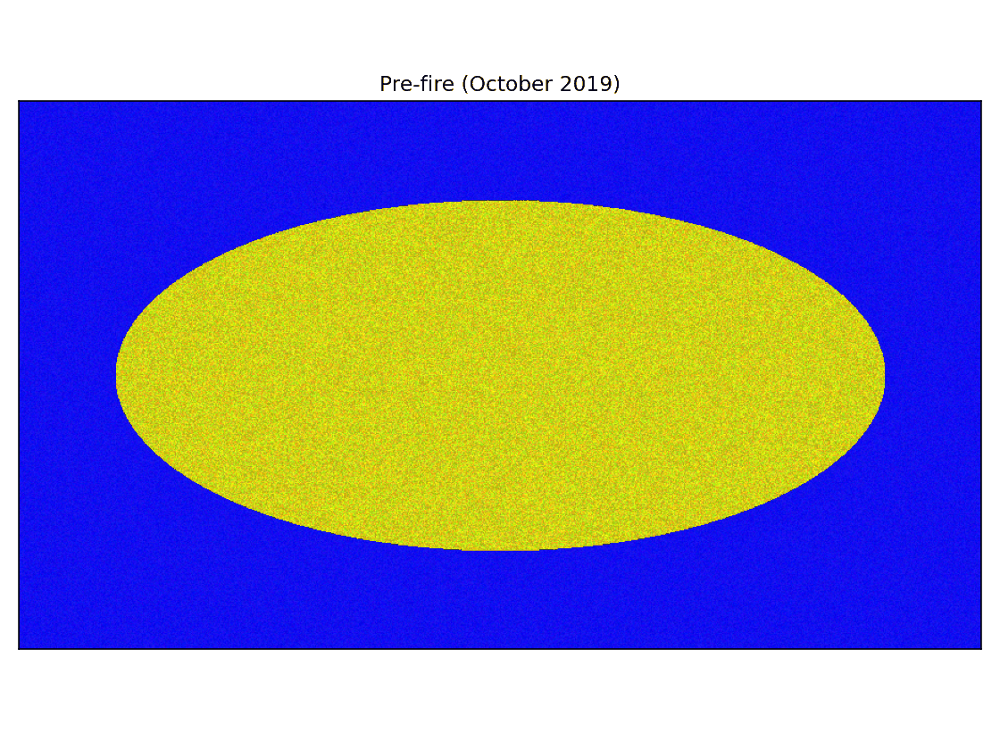
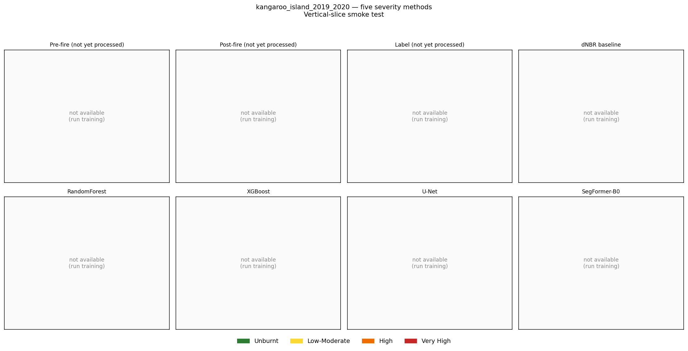

# Australian Bushfire Burn Severity Mapper

> **Mapping bushfire burn severity across four Black Summer 2019–2020 events from public Sentinel-2 imagery, using five methods from a simple threshold to a modern transformer.**



| | |
|---|---|
| 🎬 Interactive demo | [`docs/demo/kangaroo_slider.html`](docs/demo/kangaroo_slider.html) — before/after slider |
| 📖 Plain-English explainer | [`docs/demo/non_expert_panel.md`](docs/demo/non_expert_panel.md) — what the colours mean |
| 🧾 Model card | [`docs/model_card.md`](docs/model_card.md) — intended use, metrics, limitations |
| 🏗️ Architecture decisions | [`docs/architecture.md`](docs/architecture.md) — CRS, temporal, MPS |
| 📚 Data dictionary | [`docs/data_dictionary.md`](docs/data_dictionary.md) — sources, licences |

---

## ⚠️ Non-operational notice

This repository is **research and education only**. It is **not** for emergency response, public warning, dispatch, evacuation planning, insurance assessment, or any safety-of-life decision. The supervised models learn from **AUS GEEBAM** — a public satellite-derived **proxy** for burn severity. GEEBAM is **not field-validated ground truth**.

Every public-facing figure carries this caveat. Downstream users must propagate it.

---

## For non-experts — what is this?

When a bushfire passes through, healthy green vegetation gets replaced by char, ash, and exposed soil. Satellites with infrared sensors can spot this change because **living plants reflect a lot of near-infrared light** (which we can't see with our eyes), while **burned vegetation reflects much less of it and more short-wave infrared**.

This project takes free satellite photographs from before and after the 2019–2020 Australian "Black Summer" fires and trains five different computer-vision methods to estimate how badly each patch of bushland was burned. The colours in the map mean:

| Colour | Meaning |
|---|---|
| 🟢 Green | The vegetation was not visibly burned. |
| 🟡 Yellow | Some scorching — leaves/grass affected, trees likely survived. |
| 🟠 Orange | Significant burning — canopy loss in many trees. |
| 🔴 Red | The fire was hot enough that almost no green vegetation survived. |

More: [`docs/demo/non_expert_panel.md`](docs/demo/non_expert_panel.md).

---

## What this project does (technical summary)

1. **Ingests** Sentinel-2 Level-2A surface reflectance (`{B02,B03,B04,B08,B11,B12}` + SCL) via the Microsoft Planetary Computer STAC API for four 2019–2020 Australian fire events.
2. **Aligns** AUS GEEBAM fire-severity labels (ArcGIS REST `exportImage`, EPSG:3577, 40 m) onto the per-AOI UTM Sentinel-2 grid at 10 m with nearest-neighbour resampling.
3. **Builds** an 18-channel feature stack (6 pre + 6 post reflectance + 5 dIndices + slope) and tiles to 256 × 256.
4. **Compares** five severity-mapping methods under the **same event-wise hold-out split**:

   | Method | Output | Implementation |
   |---|---|---|
   | dNBR threshold | binary + 4-class (USGS) | `src/models/baselines.py` |
   | RandomForest | 4-class | `sklearn.RandomForestClassifier`, 500 trees |
   | XGBoost | 4-class | `xgboost.XGBClassifier`, `multi:softprob`, 800 trees |
   | U-Net | 4-class | `segmentation-models-pytorch`, ResNet-34 encoder, 18 → 4 |
   | SegFormer-B0 | 4-class | HF `transformers`, `nvidia/mit-b0`, first conv inflated 3 → 18 |

5. **Reports** per-event IoU/F1, per-class precision/recall, per-land-cover and per-slope stratified breakdowns, confusion matrices, reliability diagrams, ECE, and Brier scores.
6. **Publishes** a reproducible report card: figures regenerable from saved prediction GeoTIFFs via `python -m src.viz.readme_panels --mode overview`.

## Areas of interest

| Event | Split | Region | Date window |
|---|---|---|---|
| Currowan | train | NSW South Coast | Nov 2019 – Jan 2020 |
| Gospers Mountain | train | NSW Blue Mountains / Wollemi | Oct 2019 – Jan 2020 |
| Kangaroo Island | val | SA | Dec 2019 – Feb 2020 |
| East Gippsland | test | VIC | Nov 2019 – Mar 2020 |

The vertical-slice / smoke-test mode trains and tests on **Kangaroo Island only** via a random tile split. **Those numbers are spatially autocorrelated and inflate true generalisation — they are reported only to verify the pipeline runs end-to-end. The first valid generalisation number starts at the event-wise hold-out (M10).**

## Comparison panel



(Predictions render as placeholders until the corresponding training run has been executed locally; figure regenerates on every commit.)

## Quickstart

```bash
git clone <repo> bushfire-burn-severity-mapper
cd bushfire-burn-severity-mapper

python -m venv .venv && source .venv/bin/activate
pip install -e ".[dev,dl]"

# MPS fallback must be exported BEFORE torch is imported, so source first.
source scripts/setup_env.sh

# Verify the scaffold (no live network)
pytest                  # ~5s, 51/51 passing

# End-to-end for one AOI (Kangaroo Island)
python -m src.data.fetch_labels   --event kangaroo_island_2019_2020
python -m src.data.fetch_sentinel --event kangaroo_island_2019_2020 --stage all
python -m src.data.preprocess     --event kangaroo_island_2019_2020
python -m src.data.tiling         --event kangaroo_island_2019_2020 --split-mode random_tile

# Baselines + classical ML (fast on CPU)
python -m src.models.run_baseline --event kangaroo_island_2019_2020
python -m src.models.train_rf  --config configs/experiments/rf_multiclass.yaml
python -m src.models.train_xgb --config configs/experiments/xgb_multiclass.yaml

# Deep models (~hours on M4 Pro MPS; --fast-mode for a 5-epoch smoke run)
python -m src.models.train_unet      --config configs/experiments/unet_multiclass.yaml --fast-mode
python -m src.models.train_segformer --config configs/experiments/segformer_multiclass.yaml --fast-mode

# Evaluation + figures
python -m src.evaluation.evaluate --all-events
python -m src.viz.readme_panels --mode overview

# Or fan out to all four AOIs with one command
bash scripts/run_all_events.sh
```

## Repository layout

```
configs/
  config.yaml                 # root: CRS, temporal windows, class map, MPS device
  aois/*.geojson              # 4 AOI polygons (v0 bboxes; refined from NIAFED in M3)
  experiments/*.yaml          # one per model — each extends configs/config.yaml
src/
  data/      # fetch_labels (GEEBAM REST), fetch_sentinel (PC STAC + odc-stac),
             # cloud_mask (SCL+dilation), preprocess (composite+align), tiling,
             # class_map (GEEBAM → internal)
  features/  # indices, stack_features (18-channel canonical layout)
  models/    # baselines, run_baseline, tabular_dataset, train_rf, train_xgb,
             # datasets (PyTorch), unet_model, segformer_model (first-conv
             # inflation), train_segmenter (shared driver), losses (CE+Dice)
  evaluation/# metrics (ignore-safe), evaluate (aggregate),
             # stratified_reports (land-cover, slope), calibration (ECE+Brier)
  viz/       # maps (severity palette), demo_assets (slider+GIF+panel),
             # readme_panels (5-method comparison + overview)
  utils/     # config (OmegaConf+extends), geo (UTM picker), provenance
             # (sidecar manifest), seed, io, logging_utils
notebooks/   # 01_dataset_audit, 09_readme_figures
tests/       # 48 unit tests — formulas, mask, remap, RF smoke, deep forward
scripts/     # setup_env.sh (MPS fallback env), run_pipeline.sh, run_all_events.sh
docs/        # architecture, data_dictionary, model_card, demo/, figures/,
             # reviews/  (Codex CLI review transcript per milestone)
LICENSES/    # Per-source attribution notices
```

## Engineering decisions worth knowing

- **Working CRS is per-AOI UTM** (EPSG:32750–32756) for reflectance + tiles + predictions; **EPSG:3577 only for GEEBAM download and national display maps**. Documented at [`docs/architecture.md`](docs/architecture.md).
- **Two temporal modes per experiment**: event-specific Pre/Post (tight, clean composites) or GEEBAM-aligned (matches the upstream label's compositing windows for honest direct comparison).
- **Provenance sidecar** (`<output>.provenance.json`) accompanies every raster: source URLs, STAC items, git SHA, CRS, resampling, class remap, UTC timestamp.
- **Per-band normalisation stats from the TRAIN split only** are persisted to `outputs/models/<run>/normalization.json` and reused for val/test — guards against the most common silent leakage failure mode.
- **MPS handling**: `PYTORCH_ENABLE_MPS_FALLBACK=1` is exported by `scripts/setup_env.sh` *before* `python` starts (setting it from inside a module is too late). `torch.autocast(device_type='mps', dtype=torch.bfloat16)`; loss + final logits cast to fp32; grad-norm clipped at 1.0. The training driver times the first 10 steps and warns when subsequent step times exceed 3× baseline (typical sign of a silent MPS → CPU fallback).
- **SegFormer first-conv inflation** is structural: walk the model for the first 3-channel `Conv2d`, average its RGB kernel, repeat to 18 channels, scale by 3/18. Robust to HF attribute-path renames between transformers versions.

## Roadmap

| Milestone | Goal | Codex review |
|---|---|---|
| M1 | Scaffold + governance (CRS, temporal, licence, provenance) | ✅ [`docs/reviews/M1_codex_review.md`](docs/reviews/M1_codex_review.md) |
| M2 | GEEBAM labels ingest (ArcGIS REST exportImage + tiling for >4k px AOIs) | ✅ |
| M3 | Sentinel-2 ingest + SCL cloud mask + composites | ✅ |
| M4 | Preprocess + tiling (256×256) + label alignment (40 m → 10 m nearest) | ✅ |
| M5 | dNBR threshold baseline (binary sweep + USGS multiclass) | ✅ |
| M6 | RandomForest + XGBoost on 18-channel per-pixel features | ✅ |
| M6.5 | Non-technical demo (slider + animation + plain-English panel) | ✅ |
| M7 | U-Net on MPS bf16 | ✅ |
| M8 | SegFormer-B0 with first-conv inflation | ✅ |
| M9 | Vertical-slice 5-method comparison panel | ✅ |
| M10 | Scale-out script: full pipeline across 4 AOIs with event-wise split | ✅ |
| M11 | Stratified evaluation (land-cover, slope) + calibration (ECE, Brier) | ✅ |
| M12 | Model card + CI + final README polish | ✅ [`docs/reviews/M12_codex_review.md`](docs/reviews/M12_codex_review.md) |

## Licences and attribution

Code: MIT (see [`LICENSE`](LICENSE)). Data: each upstream dataset has its own licence — see [`docs/data_dictionary.md`](docs/data_dictionary.md) and [`LICENSES/`](LICENSES/) for the required attribution strings.

In particular: *Contains modified Copernicus Sentinel data [2019–2020] processed by ESA.* and *AUS GEEBAM © Commonwealth of Australia 2020, licensed CC-BY 4.0.*

## Acknowledgements

Built as a portfolio piece. The full scientific design lives in [`deep-research-report.md`](deep-research-report.md); this implementation is the execution layer on top of that report, with [Codex CLI](https://github.com/openai/codex-cli) reviewing the plan and every milestone gate.
