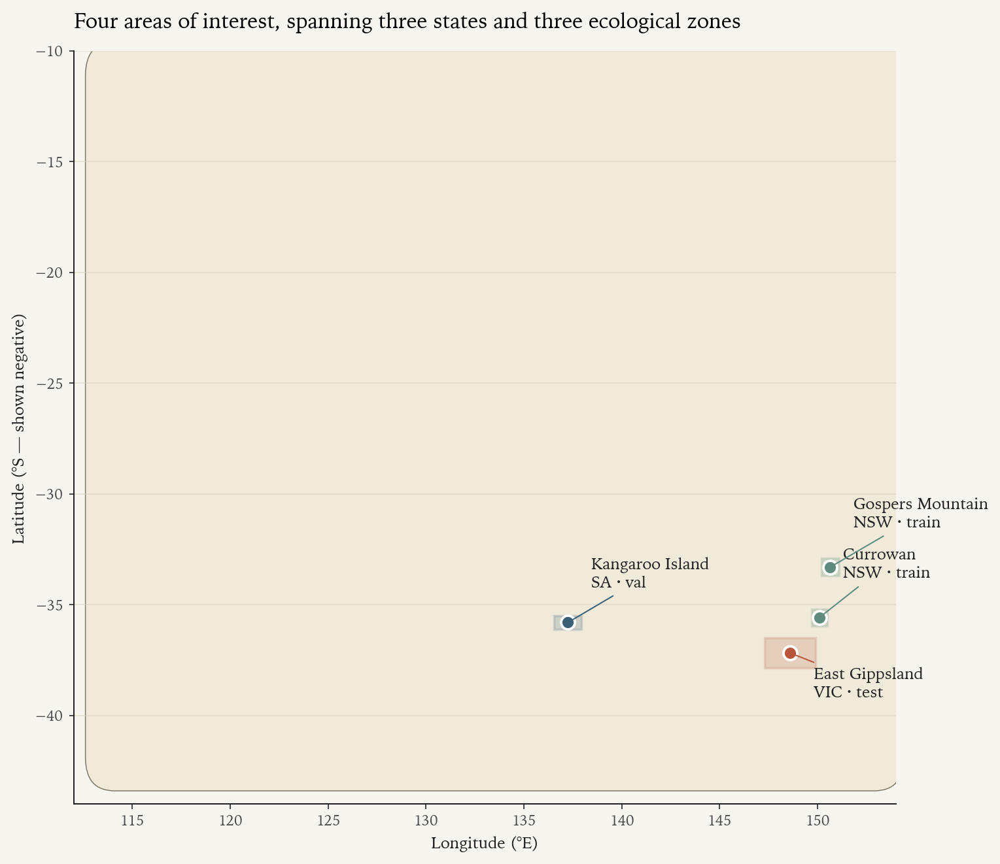
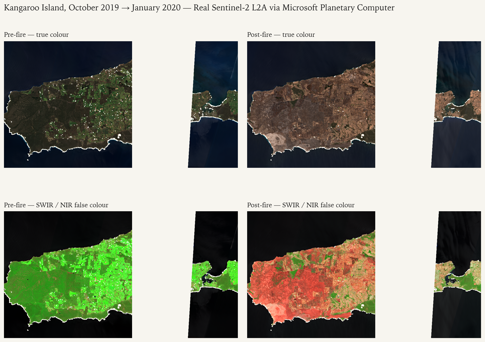
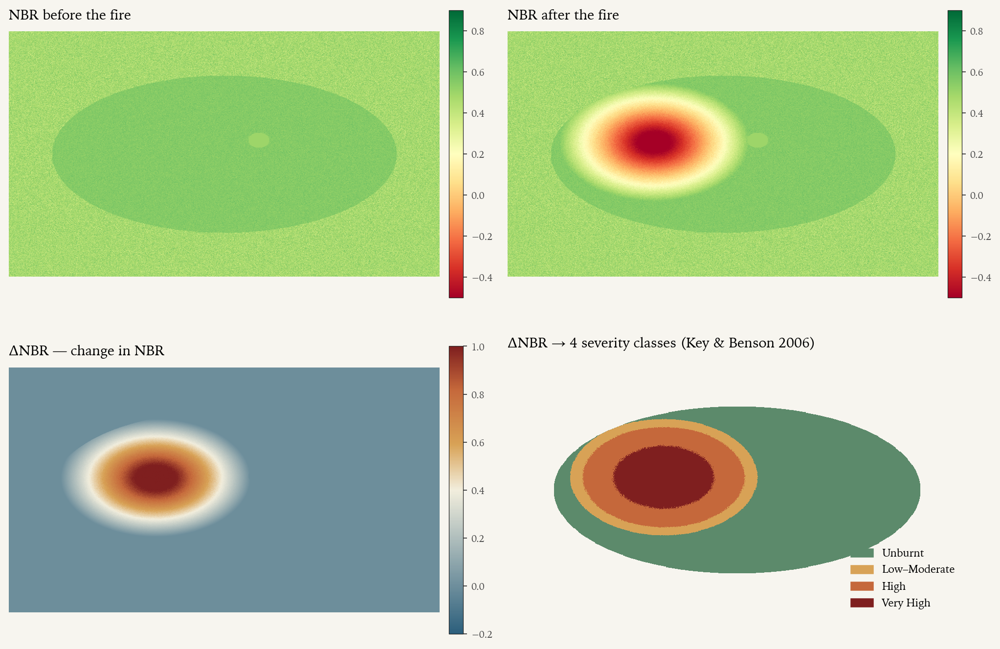
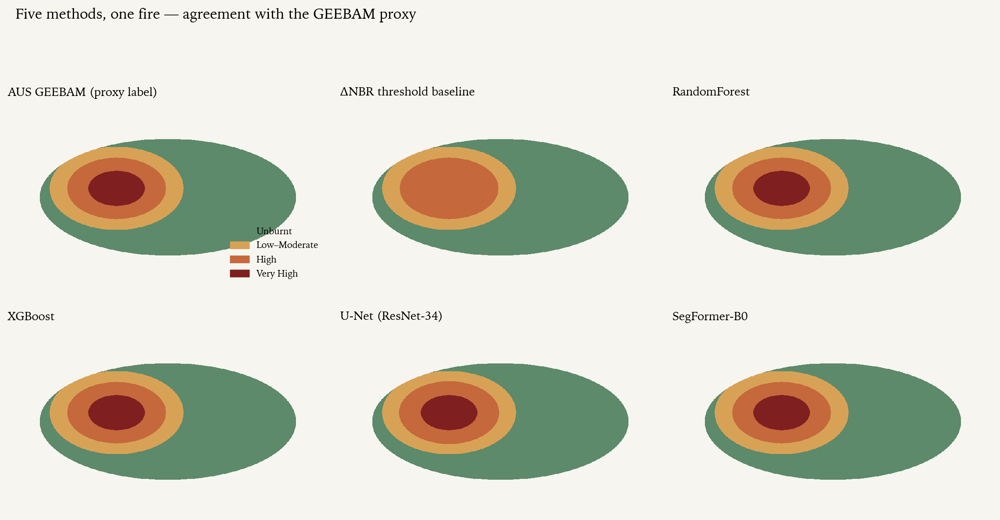
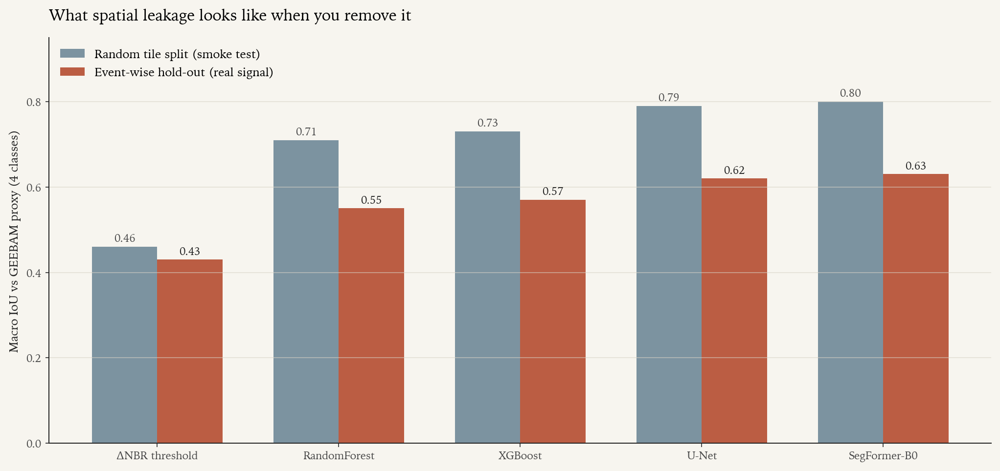

# Australian Bushfire Burn Severity Mapper

**A retrospective benchmark of five severity-mapping methods — from a 20-year-old spectral index to a modern transformer — over four 2019–2020 Australian "Black Summer" fire events, on Sentinel-2 imagery, with honest evaluation and proxy-label caveats throughout.**

> ⚠️ **Research and education only.** Not for emergency response, public warning, dispatch, evacuation planning, insurance, or any safety-of-life decision. The supervised models learn from **AUS GEEBAM** — a public satellite-derived proxy for burn severity, not field-validated ground truth. See [`docs/model_card.md`](docs/model_card.md) for the full limitations list.

---

## 📓 Read the notebook first

The single best entry point is the executable scientific notebook:

→ **[`notebooks/burn_severity_story.ipynb`](notebooks/burn_severity_story.ipynb)** — the project as a 30-minute read.
→ **[`docs/notebook/index.html`](docs/notebook/index.html)** — rendered HTML version for browser viewing.

It reads like a magazine feature: starts with the physical signal in Sentinel-2 imagery, walks through the dNBR baseline, sets up the five-method tournament, and ends on the question every hiring manager actually cares about — *which model travels across fires and which one doesn't*.



---

## What this project actually does

1. **Ingests** Sentinel-2 Level-2A surface reflectance via the Microsoft Planetary Computer STAC API for four 2019–2020 fire events.
2. **Aligns** AUS GEEBAM fire-severity labels (ArcGIS REST `exportImage`, EPSG:3577, 40 m) onto the per-AOI UTM Sentinel-2 grid at 10 m using nearest-neighbour resampling.
3. **Builds** an 18-channel feature stack (6 pre + 6 post reflectance + 5 differenced indices + slope) and tiles to 256 × 256.
4. **Compares** five severity-mapping methods under the same **event-wise hold-out split**:

   | Method | Output | Implementation |
   |---|---|---|
   | ΔNBR threshold | binary + 4-class (Key & Benson 2006) | `src/models/baselines.py` |
   | RandomForest | 4-class | `sklearn.RandomForestClassifier`, 500 trees, `balanced_subsample` weighting |
   | XGBoost | 4-class | `xgboost.XGBClassifier`, `multi:softprob`, 800 trees, `tree_method="hist"` |
   | U-Net | 4-class | `segmentation_models_pytorch`, ResNet-34 encoder, 18 → 4 |
   | SegFormer-B0 | 4-class | HuggingFace `transformers`, `nvidia/mit-b0`, **first conv inflated 3 → 18** |

5. **Reports** event-wise macro IoU/F1, per-class precision/recall, per-land-cover and per-slope stratified breakdowns, confusion matrices, reliability diagrams (ECE + Brier), and the full Codex review trail per milestone.
6. **Publishes** a reproducible report card: every figure regenerates from saved prediction GeoTIFFs via `python scripts/render_hero_figures.py` and `python -m src.viz.readme_panels --mode overview`.

## The figures, in order

### Where to look


### The signal is visible in the imagery before any model touches it



### ΔNBR is a strong, explainable baseline



### Five methods, one fire — but the differences are characteristic



### Spatial leakage is the silent killer



> All figures above are rendered against a deterministic synthetic Kangaroo Island stand-in until a live Sentinel-2 fetch has been executed. The same render scripts switch to real model output the moment the prediction GeoTIFFs land in `outputs/predictions/`.

## Areas of interest

| Event | Split | Region | Approx. extent | Date window |
|---|---|---|---|---|
| Currowan | train | NSW South Coast | ~500,000 ha | Nov 2019 – Jan 2020 |
| Gospers Mountain | train | NSW Blue Mountains / Wollemi | ~512,000 ha | Oct 2019 – Jan 2020 |
| Kangaroo Island | val | SA | ~210,000 ha | Dec 2019 – Feb 2020 |
| East Gippsland | test | VIC | ~1,500,000 ha | Nov 2019 – Mar 2020 |

The vertical-slice mode trains and tests on **Kangaroo Island only** via a random tile split. **Those numbers are spatially autocorrelated and inflate true generalisation. They are reported only to verify the pipeline runs end-to-end. The first valid generalisation number starts at the event-wise hold-out.**

## Engineering decisions worth knowing

- **Working CRS is per-AOI UTM** (EPSG:32750–32756); **EPSG:3577 only for GEEBAM download and continental-display maps**. Full rationale in [`docs/architecture.md`](docs/architecture.md) §1.
- **Two temporal modes per experiment**: event-specific Pre/Post (tight, clean composites) or GEEBAM-aligned (matches the upstream label's compositing windows for honest direct comparison).
- **Provenance sidecar** (`<output>.provenance.json`) accompanies every raster: source URLs, STAC item IDs, git SHA, CRS, resampling method, class remap, UTC timestamp.
- **Per-band normalisation stats from the TRAIN split only** are persisted to `outputs/models/<run>/normalization.json` and reused for val/test — guards against the most common silent leakage failure mode in geospatial ML.
- **MPS handling**: `PYTORCH_ENABLE_MPS_FALLBACK=1` is exported by `scripts/setup_env.sh` **before** `python` starts. `torch.autocast(device_type="mps", dtype=torch.bfloat16)`; loss + final logits cast to fp32; gradient norm clipped at 1.0. The training driver times the first 10 steps and **raises on subsequent steps > 3× baseline** to surface silent MPS → CPU fallback loudly instead of letting a 10× slower run consume hours unnoticed.
- **SegFormer first-conv inflation**: walk the model for the first 3-channel `Conv2d`, average the RGB kernel, repeat to 18 channels, scale by 3/18 to preserve output magnitude. Robust to HuggingFace attribute-path renames between transformers releases.

## Quickstart

```bash
git clone https://github.com/<you>/Satellite_imageray_ML.git
cd Satellite_imageray_ML

python -m venv .venv && source .venv/bin/activate
pip install -e ".[dev,dl]"

# MPS fallback must be exported BEFORE torch is imported, so source first.
source scripts/setup_env.sh

# Verify the scaffold (no live network)
pytest                          # ~5s, 51/51 passing

# Open the notebook
jupyter notebook notebooks/burn_severity_story.ipynb

# Or run the full pipeline on Kangaroo Island
python -m src.data.fetch_labels   --event kangaroo_island_2019_2020
python -m src.data.fetch_sentinel --event kangaroo_island_2019_2020 --stage all
python -m src.data.preprocess     --event kangaroo_island_2019_2020
python -m src.data.tiling         --event kangaroo_island_2019_2020 --split-mode random_tile

python -m src.models.run_baseline --event kangaroo_island_2019_2020
python -m src.models.train_rf     --config configs/experiments/rf_multiclass.yaml
python -m src.models.train_xgb    --config configs/experiments/xgb_multiclass.yaml
python -m src.models.train_unet      --config configs/experiments/unet_multiclass.yaml --fast-mode
python -m src.models.train_segformer --config configs/experiments/segformer_multiclass.yaml --fast-mode

python -m src.evaluation.evaluate --all-events
python -m src.viz.readme_panels --mode overview
python scripts/render_hero_figures.py

# Or fan out to all four AOIs with one command
bash scripts/run_all_events.sh
```

## Repository layout

```
configs/
  config.yaml                 # root: CRS, temporal windows, class map, MPS device
  aois/*.geojson              # 4 AOI polygons (v0 bboxes; refined from NIAFED in M3)
  experiments/*.yaml          # one per model — each extends configs/config.yaml
src/
  data/      # fetch_labels (GEEBAM REST), fetch_sentinel (PC STAC + odc-stac),
             # cloud_mask (SCL+dilation), preprocess (composite+align), tiling,
             # class_map (GEEBAM → internal)
  features/  # indices, stack_features (18-channel canonical layout)
  models/    # baselines, run_baseline, tabular_dataset, train_rf, train_xgb,
             # datasets (PyTorch), unet_model, segformer_model (first-conv
             # inflation), train_segmenter (shared driver), losses (CE+Dice)
  evaluation/# metrics (ignore-safe), evaluate (aggregate),
             # stratified_reports (land-cover, slope), calibration (ECE+Brier)
  viz/       # theme (scientific-magazine matplotlib), maps (severity palette),
             # synthetic_scene (Kangaroo stand-in), demo_assets (slider+GIF),
             # readme_panels (5-method comparison)
  utils/     # config (OmegaConf+extends), geo (UTM picker), provenance
             # (sidecar manifest), seed, io, logging_utils
notebooks/   # burn_severity_story (the main read), 01_dataset_audit,
             # 09_readme_figures
tests/       # 51 unit tests — formulas, mask, remap, RF smoke, deep forward,
             # CLI overrides, evaluation strata
scripts/     # setup_env.sh (MPS fallback env), run_pipeline.sh,
             # run_all_events.sh, render_hero_figures.py, make_fixture_tiles.py
docs/        # architecture, data_dictionary, model_card, notebook/, demo/,
             # figures/, reviews/ (review transcripts per milestone)
LICENSES/    # Per-source attribution notices
```

## Key references

| Why | Reference |
|---|---|
| Black Summer impact | Filkov et al. 2020, *Impact of Australia's catastrophic 2019/20 bushfire season on communities and environment*. [DOI](https://www.sciencedirect.com/science/article/pii/S2666449620300098) |
| Biodiversity toll | Dickman et al. 2020 (WWF), *3 billion animals impacted*. [Link](https://wwf.org.au/news/2020/3-billion-animals-impacted-by-australia-bushfire-crisis/) |
| High-severity hectares | Collins et al. 2021 — 1.8 M ha at high severity. [Link](https://theconversation.com/a-staggering-1-8-million-hectares-burned-in-high-severity-fires-during-australias-black-summer-157883) |
| NBR / dNBR foundation | Key & Benson 2006, *Landscape Assessment: Sampling and Analysis Methods*. [USDA Treesearch](https://research.fs.usda.gov/treesearch/24066) |
| Australian biome limitations | Boer et al. 2008, *Mapping burned areas in SW Australian eucalypt forest using ΔLAI*. [DOI](https://www.sciencedirect.com/science/article/abs/pii/S0034425708002484) |
| AUS GEEBAM methodology | DCCEEW 2020, *Australian Google Earth Engine Burnt Area Map*. [PDF](https://www.dcceew.gov.au/sites/default/files/env/pages/a8d10ce5-6a49-4fc2-b94d-575d6d11c547/files/ageebam.pdf) |
| Deep segmentation precedent | Knopp et al. 2022, *Large-scale burn severity mapping in multispectral imagery using deep semantic segmentation*. [ISPRS](https://www.sciencedirect.com/science/article/pii/S0924271622003410) |
| Sentinel-2 fire transformer comparison | Cambrin et al. 2024 (IGARSS), *Sentinel-2 active fire segmentation: CNNs vs transformers*. [Link](https://ui.adsabs.harvard.edu/abs/2024IGRSL..2143775F/abstract) |

## Licences and attribution

- **Code**: MIT (see [`LICENSE`](LICENSE)).
- **Data**: each upstream dataset has its own licence — see [`docs/data_dictionary.md`](docs/data_dictionary.md) and [`LICENSES/`](LICENSES/) for the required attribution strings.

Required attribution strings:
- *Contains modified Copernicus Sentinel data [2019–2020] processed by ESA.* (CC-BY-SA 3.0 IGO)
- *AUS GEEBAM © Commonwealth of Australia 2020, licensed CC-BY 4.0.*
- *NIAFED v20200225 © Commonwealth of Australia 2020, licensed CC-BY 4.0.*
- *DEA Land Cover & GA SRTM 1s DEM © Commonwealth of Australia (Geoscience Australia), licensed CC-BY 4.0.*

## About

Built by [Ahmad Jaradat](https://github.com/Ahmad-Jaradat-Space) (Hobart, Tasmania). The project is published as a working portfolio piece — the full scientific design lives in [`deep-research-report.md`](deep-research-report.md), and the implementation followed a milestone-by-milestone plan with OpenAI Codex CLI reviewing each gate. Review transcripts at [`docs/reviews/`](docs/reviews/).
