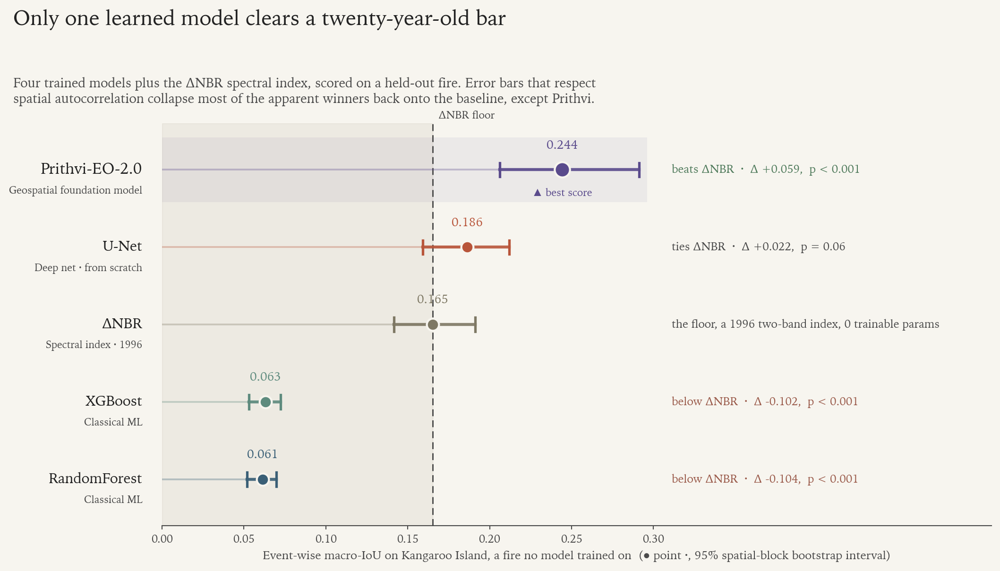
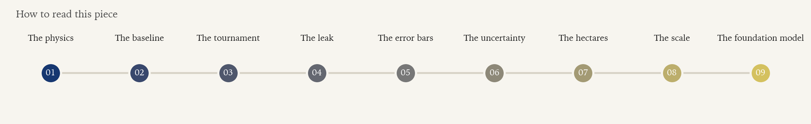
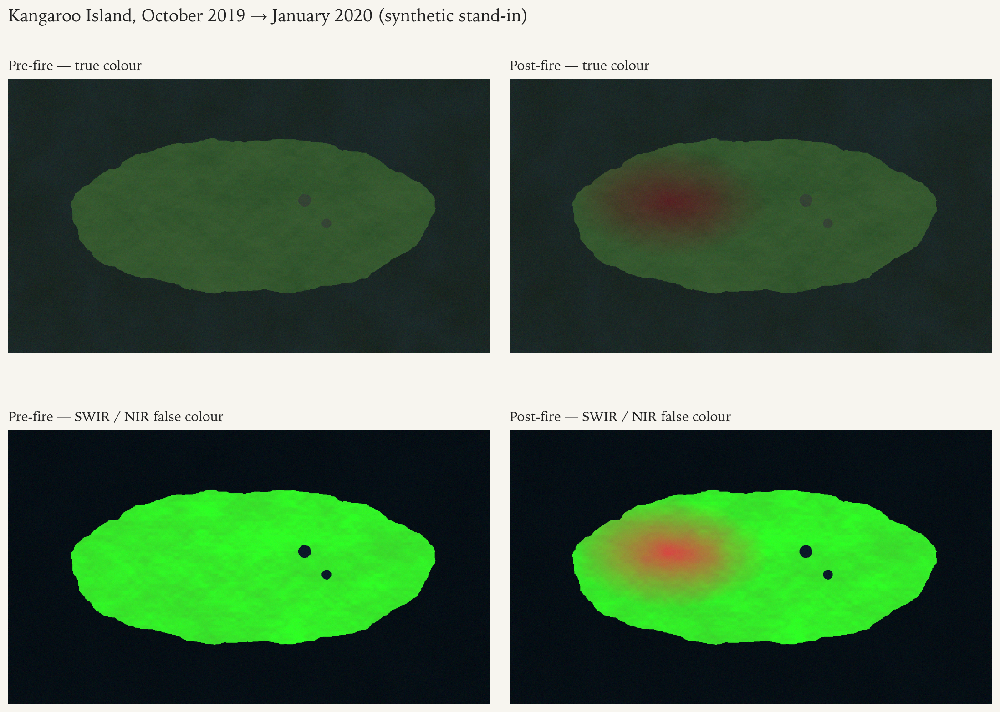
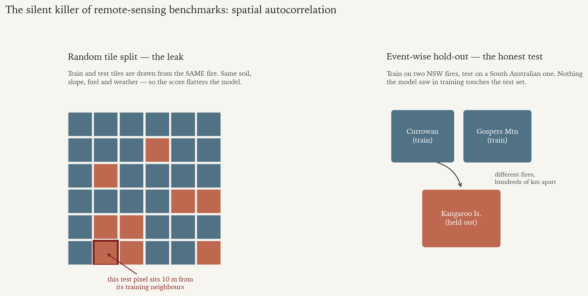
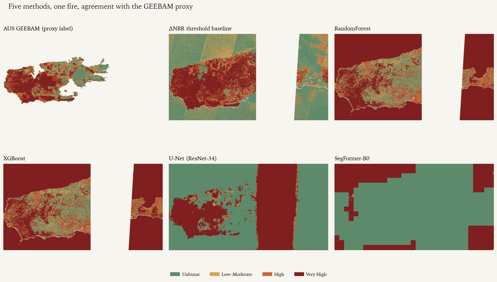
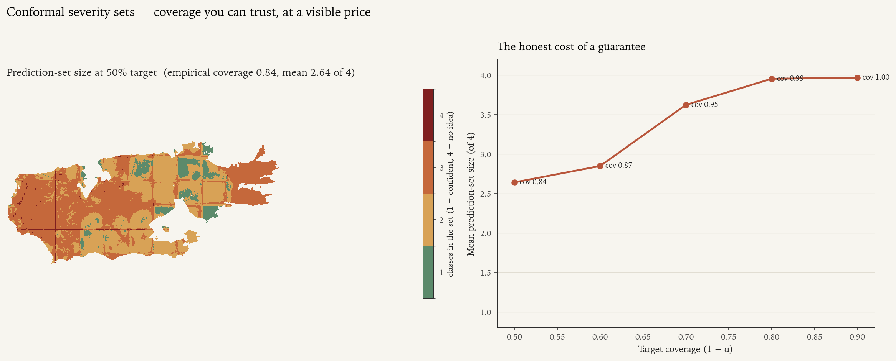
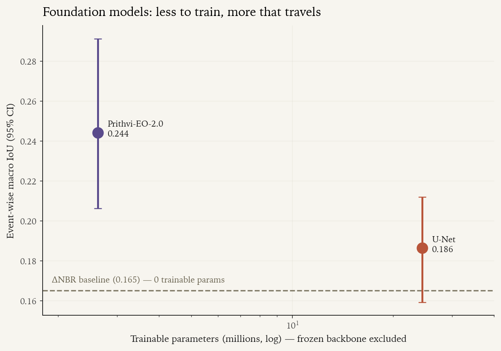

<div align="center">

# 🔥 Australian Bushfire Burn-Severity Mapper

**Can a small deep model beat a twenty-year-old spectral index — without pretending the labels are ground truth?**

A reproducible benchmark of **six** burn-severity methods — from a 1996 spectral index to a **geospatial foundation model** — across four 2019–2020 *Black Summer* megafires on Sentinel-2 imagery, built around the discipline that separates a prototype from a product: **honest event-wise evaluation, calibrated uncertainty, and design-based accuracy.**

<br>

[](https://github.com/Ahmad-Jaradat-Space/bushfire-burn-severity-mapper/actions/workflows/ci.yml)


[](LICENSE)

**[📓 Read the notebook](notebooks/burn_severity_story.ipynb)** · [🗺️ Capability matrix](docs/capability_matrix.md) · [📋 Model card](docs/model_card.md) · [📐 Architecture](docs/architecture.md) · [🚀 Quickstart](#-quickstart)

<br>



<sub><b>The bottom line, up front.</b> Every method scored on a fire <i>none of them trained on</i>, with 95% spatial-block bootstrap intervals. Most apparent winners <i>tie</i> a spectral index from 1996; only the frozen <b>Prithvi-EO-2.0</b> foundation model clears it by a statistically significant margin (Δ macro-IoU +0.06, <i>p</i> &lt; 0.001) — with a tenth of the trainable parameters.</sub>

</div>

> [!WARNING]
> **Research and education only.** Not for emergency response, public warning, dispatch, evacuation planning, insurance, or any safety-of-life decision. The supervised models learn from **AUS GEEBAM** — a public satellite-derived *proxy* for burn severity, not field-validated ground truth. Full limitations in the [model card](docs/model_card.md).

---

## ✦ Why this stands out

- **Six methods, one honest yardstick.** ΔNBR · RandomForest · XGBoost · U-Net · SegFormer-B0 · **Prithvi-EO-2.0 (300 M-parameter foundation model)** — the same imagery, labels, and *event-wise* split for every one.
- **The result survives the error bars.** A spatial-block bootstrap that respects spatial autocorrelation dissolves most apparent "wins" back onto the baseline. Only the foundation model beats a 1996 index by a statistically significant margin — a claim defended with confidence intervals, not vibes.
- **Four disciplines, not just a model.** Applied **statistics**, **uncertainty quantification**, **econometrics**, and **geospatial delivery** — each shipped as a reproducible figure.
- **Built like a product.** Per-raster provenance sidecars, MLflow tracking, a Docker image, a tiled batch-inference benchmark, and a documented **GCP** deployment path.
- **Honest throughout.** Calibrated "I don't know" (conformal prediction sets), design-based (Olofsson) area estimates, and the word *proxy* — never "ground truth."

---

## 📓 Read the notebook first

The single best entry point is the executable scientific notebook — it reads like a magazine feature and renders end-to-end on GitHub:

> **→ [`notebooks/burn_severity_story.ipynb`](notebooks/burn_severity_story.ipynb)** — the whole project as a ~30-minute read.
> Prefer a browser tab? An [HTML render](docs/notebook/index.html) is committed too.

It opens with the physical signal in Sentinel-2 imagery, sets up the six-method tournament, and spends most of its energy on the part that actually matters: **which model travels across fires, which one doesn't, and how you prove the difference is real.**

<div align="center">

</div>

---

## 🛰️ What it does

1. **Ingests** Sentinel-2 Level-2A surface reflectance via the Microsoft Planetary Computer STAC API for four 2019–2020 fire events.
2. **Aligns** AUS GEEBAM fire-severity labels (ArcGIS REST `exportImage`, EPSG:3577) onto the per-AOI UTM Sentinel-2 grid using nearest-neighbour resampling.
3. **Builds** an 18-channel feature stack (6 pre + 6 post reflectance + 5 differenced indices + slope) and tiles it to 256 × 256.
4. **Compares** six methods under the **same event-wise hold-out split** — no fire appears in both training and test:

   | Method | Family | Implementation |
   |---|---|---|
   | **ΔNBR threshold** | Spectral index (1996) | Key & Benson 2006 breakpoints · `src/models/baselines.py` |
   | **RandomForest** | Classical ML | `sklearn`, 500 trees, balanced weighting |
   | **XGBoost** | Classical ML | `xgboost`, `multi:softprob`, 800 trees, `hist` |
   | **U-Net** | Deep net (from scratch) | `segmentation_models_pytorch`, ResNet-34, 18 → 4 |
   | **SegFormer-B0** | Deep net (from scratch) | HuggingFace `nvidia/mit-b0`, first conv inflated 3 → 18 |
   | **Prithvi-EO-2.0-300M** | 🛰️ **Foundation model** | NASA/IBM geospatial ViT — frozen 304 M backbone + trained decoder (`terratorch`) |

5. **Reports** event-wise macro IoU/F1, per-class precision/recall, per-land-cover and per-slope strata, confusion matrices, and reliability diagrams (ECE + Brier).
6. **Quantifies the uncertainty** in every claim — bootstrap CIs, significance tests, conformal sets, and area-adjusted accuracy (below).

> [!NOTE]
> Figures are rendered from **real** Sentinel-2 composites and saved model predictions, and regenerate from the saved GeoTIFFs. A deterministic synthetic Kangaroo Island stand-in lets the notebook and figure scripts run offline before any data is fetched.

---

## 🧪 The senior-level analysis

Beyond the model tournament, the notebook carries the rigour that separates a prototype from a product — each as a reproducible figure.

| Discipline | What it shows | Figures |
|---|---|---|
| **Statistics** | Spatial-block bootstrap CIs + McNemar — the U-Net's edge over ΔNBR is *not* significant; Prithvi's *is*. Olofsson area-adjusted hectares. | 06–08 |
| **Rare classes** | Per-class precision/recall: the tree models score recall **0.00** on "Very High". | 08b |
| **Econometrics** | A cluster-robust logistic GLM of error: controlling for class and burn signal, **slope is not significant**. | 09 |
| **Uncertainty** | MC-dropout epistemic maps + conformal prediction sets with a coverage/efficiency curve. | 10–11 |
| **Geospatial delivery** | Severity → polygons → management-unit roll-up, PostGIS-ready, with a QGIS style. | 12–13 |
| **Scale** | Throughput / memory / projected cloud cost to map a whole state at aerial resolution. | 14–15 |
| **Foundation model** | Frozen Prithvi-EO-2.0 beats the from-scratch U-Net with **1/10th** the trainable parameters. | 16 |

<details>
<summary><b>🖼️ Open the figure gallery</b></summary>

<br>

<div align="center">

**The signal is visible before any model touches it** — Sentinel-2 pre/post, true & false colour


**The one move that makes the benchmark honest** — random-tile leak vs event-wise hold-out


**Five methods, one fire** — characteristic failure modes side by side


**Calibrated uncertainty** — conformal severity sets that grow where the model is unsure


**Foundation model efficiency** — fewer trainable parameters, more that travels across biomes


</div>
</details>

Regenerate the analysis: `python scripts/compute_uncertainty.py` · `python -m src.stats.confounders` · `python scripts/compute_uq.py` · `python scripts/compute_vector.py` · `python scripts/benchmark_inference.py`

---

## 🌏 What it demonstrates for an ecological-monitoring platform

The case study is burn severity; the capabilities are the ones a landscape-scale ecological-monitoring platform runs on. Full mapping in [`docs/capability_matrix.md`](docs/capability_matrix.md).

| Capability | In the repo | Transfers to |
|---|---|---|
| DL segmentation + a **foundation model** (Prithvi-EO-2.0) | `src/models/` | vegetation / lifeform / rehab-stage mapping; scarce-label generalisation |
| Geospatial vector engineering — polygonise, overlay, **PostGIS**, **QGIS**, mosaicking | `src/geospatial/`, `sql/`, `qgis/` | management-unit / bioregion / tenure reporting |
| Spatial & survey **sampling** + design-based (Olofsson) accuracy | `src/data/spatial_sampling.py`, `src/evaluation/area_estimation.py` | representative, defensible train/val/assessment design |
| **Uncertainty** (MC-dropout, conformal sets, calibration) | `src/evaluation/{uq_maps,conformal}.py` | trustworthy figures; flagging "I don't know" |
| Applied **statistics / econometrics** (bootstrap CIs, McNemar, confounder GLM) | `src/evaluation/uncertainty.py`, `src/stats/` | honest effect sizes, controlling for confounders |
| **MLOps / scale** — Docker, MLflow, batch-inference benchmark, **GCP** design | `docker/`, `src/inference/`, `docs/cloud_gcp.md` | enterprise jobs at landscape scale |

---

## 🗺️ Areas of interest

| Event | Split | Region | Approx. extent | Date window |
|---|---|---|---|---|
| Currowan | `train` | NSW South Coast | ~500,000 ha | Nov 2019 – Jan 2020 |
| Gospers Mountain | `train` | NSW Blue Mountains / Wollemi | ~512,000 ha | Oct 2019 – Jan 2020 |
| Kangaroo Island | `val` | SA | ~210,000 ha | Dec 2019 – Feb 2020 |
| East Gippsland | `test` | VIC | ~1,500,000 ha | Nov 2019 – Mar 2020 |

> [!NOTE]
> A vertical-slice mode trains and tests on **Kangaroo Island only** via a random tile split. Those numbers are spatially autocorrelated and *inflate* true generalisation — they exist only to verify the pipeline runs end-to-end. **The first valid generalisation number starts at the event-wise hold-out.**

---

## 🚀 Quickstart

```bash
git clone https://github.com/Ahmad-Jaradat-Space/bushfire-burn-severity-mapper.git
cd bushfire-burn-severity-mapper

python -m venv .venv && source .venv/bin/activate
pip install -e ".[dev,dl]"

# MPS fallback must be exported BEFORE torch is imported, so source first.
source scripts/setup_env.sh

pytest                                   # ~12s, 88 passing (1 skipped: live PostGIS)
jupyter notebook notebooks/burn_severity_story.ipynb
```

<details>
<summary><b>Run the full pipeline on one AOI</b></summary>

```bash
# Fetch → composite → align → tile
python -m src.data.fetch_labels   --event kangaroo_island_2019_2020
python -m src.data.fetch_sentinel --event kangaroo_island_2019_2020 --stage all
python -m src.data.preprocess     --event kangaroo_island_2019_2020
python -m src.data.tiling         --event kangaroo_island_2019_2020 --split-mode random_tile

# Train the tournament
python -m src.models.run_baseline    --event kangaroo_island_2019_2020
python -m src.models.train_rf        --config configs/experiments/rf_multiclass.yaml
python -m src.models.train_xgb       --config configs/experiments/xgb_multiclass.yaml
python -m src.models.train_unet      --config configs/experiments/unet_multiclass.yaml --fast-mode
python -m src.models.train_segformer --config configs/experiments/segformer_multiclass.yaml --fast-mode
python -m src.models.train_prithvi   # frozen geospatial foundation model

# Evaluate + render
python -m src.evaluation.evaluate --all-events
python scripts/render_hero_figures.py

# Or fan out to all four AOIs with one command
bash scripts/run_all_events.sh
```
</details>

---

<details>
<summary><b>📁 Repository layout</b></summary>

```
configs/
  config.yaml                 # root: CRS, temporal windows, class map, MPS device
  aois/*.geojson              # 4 AOI polygons
  experiments/*.yaml          # one per model — each extends configs/config.yaml
src/
  data/        # fetch_labels (GEEBAM REST), fetch_sentinel (PC STAC), cloud_mask,
               # preprocess (composite+align), tiling, spatial_sampling, class_map
  features/    # indices, stack_features (18-channel layout), terrain (DEM→slope)
  models/      # baselines, train_{rf,xgb}, unet/segformer/prithvi, train_segmenter
  evaluation/  # metrics, blocks, uncertainty (bootstrap/McNemar), area_estimation,
               # conformal, uq_maps, calibration, *_report (figure factories)
  stats/       # confounders (cluster-robust logistic GLM)
  geospatial/  # vectorize, overlay, mosaic, postgis_io, report
  inference/   # batch_infer (tiled), scale_report (throughput/cost)
  viz/         # theme, story_figures (the README/notebook hero figures), maps
  utils/       # config (OmegaConf), geo (UTM picker), provenance, tracking (MLflow)
notebooks/     # burn_severity_story (the main read)
tests/         # 88 unit tests — formulas, masks, bootstrap, conformal, geospatial…
scripts/       # setup_env.sh, compute_*, benchmark_inference, render_hero_figures
docker/ sql/ qgis/   # container, PostGIS schema/queries, QGIS style
docs/          # architecture, model_card, capability_matrix, cloud_gcp, figures/, reviews/
```
</details>

<details>
<summary><b>⚙️ Engineering decisions worth knowing</b></summary>

<br>

- **Working CRS is per-AOI UTM** (EPSG:32750–32756); EPSG:3577 only for the GEEBAM download and continental-display maps. Rationale in [`docs/architecture.md`](docs/architecture.md) §1.
- **Provenance sidecar** (`<output>.provenance.json`) accompanies every raster: source URLs, STAC item IDs, git SHA, CRS, resampling method, class remap, UTC timestamp.
- **Per-band normalisation stats come from the TRAIN split only**, persisted and reused for val/test — guarding against the most common silent leakage failure in geospatial ML.
- **MPS handling**: `PYTORCH_ENABLE_MPS_FALLBACK=1` is exported *before* `python` starts; bf16 autocast with fp32 loss/logits and grad-norm clipping. The trainer times the first 10 steps and **raises if later steps run > 3× slower**, surfacing a silent MPS → CPU fallback loudly instead of letting a 10× slower run burn hours.
- **SegFormer first-conv inflation**: average the pretrained RGB kernel and repeat to 18 channels, scaled by 3/18 to preserve output magnitude — robust to HuggingFace attribute-path renames.

</details>

<details>
<summary><b>📚 Key references</b></summary>

<br>

| Why | Reference |
|---|---|
| Black Summer impact | Filkov et al. 2020, *Impact of Australia's 2019/20 bushfire season*. [DOI](https://www.sciencedirect.com/science/article/pii/S2666449620300098) |
| Biodiversity toll | Dickman et al. 2020 (WWF), *3 billion animals impacted*. [Link](https://wwf.org.au/news/2020/3-billion-animals-impacted-by-australia-bushfire-crisis/) |
| High-severity hectares | Collins et al. 2021 — 1.8 M ha at high severity. [Link](https://theconversation.com/a-staggering-1-8-million-hectares-burned-in-high-severity-fires-during-australias-black-summer-157883) |
| NBR / dNBR foundation | Key & Benson 2006, *Landscape Assessment*. [USDA Treesearch](https://research.fs.usda.gov/treesearch/24066) |
| Design-based accuracy | Olofsson et al. 2014, *Good practices for estimating area and accuracy of land change*. [DOI](https://doi.org/10.1016/j.rse.2014.02.015) |
| Geospatial foundation model | Prithvi-EO-2.0 (NASA/IBM). [Hugging Face](https://huggingface.co/ibm-nasa-geospatial/Prithvi-EO-2.0-300M) |
| AUS GEEBAM methodology | DCCEEW 2020, *Australian Google Earth Engine Burnt Area Map*. [PDF](https://www.dcceew.gov.au/sites/default/files/env/pages/a8d10ce5-6a49-4fc2-b94d-575d6d11c547/files/ageebam.pdf) |
| Deep segmentation precedent | Knopp et al. 2022, *Large-scale burn severity mapping with deep semantic segmentation*. [ISPRS](https://www.sciencedirect.com/science/article/pii/S0924271622003410) |

</details>

---

## 📄 Licence & attribution

**Code** is [MIT](LICENSE). **Data** carries each upstream licence — see [`docs/data_dictionary.md`](docs/data_dictionary.md) and [`LICENSES/`](LICENSES/).

<sub>
Contains modified Copernicus Sentinel data [2019–2020] processed by ESA (CC-BY-SA 3.0 IGO) · AUS GEEBAM © Commonwealth of Australia 2020 (CC-BY 4.0) · NIAFED v20200225 © Commonwealth of Australia 2020 (CC-BY 4.0) · DEA Land Cover &amp; GA SRTM 1s DEM © Commonwealth of Australia / Geoscience Australia (CC-BY 4.0).
</sub>

## 🙋 About

Built by **[Ahmad Jaradat](https://github.com/Ahmad-Jaradat-Space)** (Hobart, Tasmania). Published as a working scientific notebook — the full scientific design lives in [`deep-research-report.md`](deep-research-report.md), and the implementation followed a milestone-by-milestone plan with each gate reviewed via the Codex CLI ([transcripts](docs/reviews/)).

<div align="center"><sub>If this was useful or interesting, a ⭐ is always appreciated.</sub></div>
