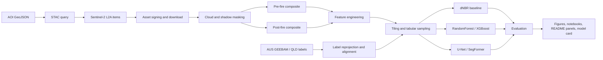
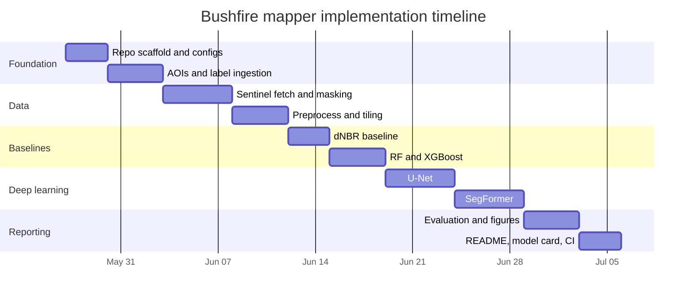

# PROJECT_IMPLEMENTATION_PLAN.md

## Executive summary

This plan specifies a research-grade GitHub repository for an **Australian Bushfire Burn Severity Mapper** that Claude Code can implement end-to-end. The recommended first release is a **non-operational, retrospective burn-severity mapping pipeline** that uses **Sentinel-2 Level-2A surface reflectance imagery** as input and **AUS GEEBAM** as the primary severity label source, with **NIAFED** as the fire-extent mask and **DEA Land Cover** plus **GA SRTM DEM** as optional ancillary layers. That combination is the best balance of public availability, Australian relevance, reproducibility, and implementation simplicity for a first version. citeturn34view2turn4view1turn14view0turn14view1turn22search0turn2search0

The first version should **not** be framed as an operational emergency tool. That warning is not optional. AUS GEEBAM explicitly notes that its classes are not based on field data and that its published comparisons against state products are not traditional validation because there is no true point-of-truth dataset in the comparison; DEA Hotspots also explicitly warns that it is not for safety-of-life decisions and is not real time. The repository must therefore present outputs as **research and retrospective analytics only**, not as incident response, dispatch, evacuation, or public warning support. citeturn34view2turn4view1turn41view0

The implementation sequence should be staged. Start with a **strong, explainable baseline**: pre/post Sentinel-2 compositing, NBR and dNBR generation, and a thresholded baseline. Then add **classical ML** on engineered features using RandomForest and XGBoost. Only after the data and evaluation pipeline are stable should the repo add **deep semantic segmentation** with a compact U-Net, followed by SegFormer-B0 as the higher-capacity model. This stage order is practical because it reduces the risk that Claude Code spends effort on GPU training before the label alignment, masking, tiling, and event-wise evaluation are correct. citeturn27view0turn39search8turn39search5turn39search3turn39search1

The core data-access recommendation is to use **Microsoft Planetary Computer** as the primary imagery source for the repo because it has a public STAC API and a public Sentinel-2 L2A collection, while keeping **Copernicus Data Space Ecosystem** as the official fallback path. The old Copernicus Open Access Hub / SciHub path should not be used as the implementation default because Copernicus migrated users to CDSE and decommissioned the old public hubs in 2023. citeturn22search0turn2search0turn21search6turn4view6turn38search0turn38search10

## Project scope and dataset strategy

The repository scope should be narrow and explicit: **map retrospective burn severity from public satellite imagery over selected Australian bushfire events**, compare threshold methods, classical ML, and deep learning, and publish reproducible notebooks and figures. It should not attempt forecasting, real-time active-fire detection, or operational alerting. DEA’s own hazard products distinguish between near-real-time indicative products, active-thermal products, and retrospective severity products, and their limitations are material; mirroring those limits in the repo keeps the science honest. citeturn41view0turn8view0turn34view2

### Dataset comparison

| Name | Official URL | Coverage | Labels available | Access method | Pros | Cons | Evidence |
|---|---|---|---|---|---|---|---|
| Sentinel-2 L2A via Microsoft Planetary Computer | `https://planetarycomputer.microsoft.com/dataset/sentinel-2-l2a` | Global Sentinel-2 archive; Planetary Computer STAC available via `https://planetarycomputer.microsoft.com/api/stac/v1` | No labels; imagery only | STAC API, signed assets | Easy STAC workflow; cloud-optimised assets; well suited to local Python workflows | Public STAC metadata is open, but asset access uses signed URLs/tokens; Australian-specific ARD adjustments are not the point of this source | citeturn2search0turn22search0turn21search6turn40search0 |
| Sentinel-2 L2A via Copernicus Data Space Ecosystem | `https://dataspace.copernicus.eu/data-collections/copernicus-sentinel-missions/sentinel-2` and STAC `https://stac.dataspace.copernicus.eu/v1/` | Official Copernicus Sentinel archive | No labels; imagery only | CDSE STAC API / browser / official APIs | Official Copernicus path; best long-term “source of truth” fallback | Bulk-download account policy and quotas are not fully specified in the parsed docs here; old Open Access Hub workflow is obsolete | citeturn4view6turn38search1turn38search0turn38search10 |
| AUS GEEBAM Fire Severity | `https://gis.environment.gov.au/gispubmap/rest/services/threats/AUS_GEEBAM_Fire_Severity/MapServer/0` | 2019–20 NIAFED fire footprint; extent roughly 114.2E–153.6E and 43.45S–10.58S; 40 m raster | Yes; classes 1–5 where 2=Unburnt, 3=Low/Moderate, 4=High, 5=Very High | Public ArcGIS REST layer; DCCEEW download page exists but direct file URL was not parsable here | Australian national severity labels; directly relevant to the project; class definitions published | No field-data calibration; known issues; one season only; low/moderate combined | citeturn34view2turn4view1 |
| National Indicative Aggregated Fire Extent Dataset | `https://fed.dcceew.gov.au/datasets/national-indicative-aggregated-fire-extent-dataset` | Cumulative national fire extent from 1 Jul 2019 to 24 Feb 2020 | Fire extent, not severity | DCCEEW dataset page; exact download path unspecified in parsed output | Correct companion extent mask for AUS GEEBAM; national scope | Exact direct download method was unspecified in parsed lines; extent inherits upstream limitations | citeturn4view1turn34view2 |
| Queensland Sentinel-2 fire scars series | `https://www.data.qld.gov.au/dataset/sentinel-2-queensland-fire-scars-series` | Queensland; monthly statewide products from 2017 onwards at 10 m; Sentinel-2 era from 2017 onwards, with Queensland service metadata also noting Sentinel-2 from 2018 onwards in statewide service descriptions | Binary burnt / not-burnt extent, not severity | Queensland Open Data landing page; OGC WMS/WFS services | Strong Australian public burn-scar source; validated statewide method; good for binary pretraining or extension | Not a severity product; access pages are JS-heavy; exact file endpoint unspecified here | citeturn12view0turn42search0turn42search1turn42search5 |
| DEA Burnt Area Characteristic Layers Sentinel-2 NRT | `https://knowledge.dea.ga.gov.au/data/product/dea-burnt-area-characteristic-layers-sentinel-2-near-real-time/` | Australia; 1 Jul 2021 to 29 Aug 2023; 10 m | Not severity labels; delta indices and fmask | DEA ODC / DEA STAC / AWS | Australian near-real-time change layers; useful for exploratory overlays or future extension | Provisional; no further updates; not a fire-severity ground truth source | citeturn8view0turn9view4 |
| DEA Hotspots | `https://knowledge.dea.ga.gov.au/data/product/dea-hotspots/` | Australia; 27 Aug 2002 to present; updates every 10 minutes | Active thermal anomaly points, not severity | AWS, WMS, WFS, KML, GeoJSON | Useful exploratory active-fire overlay; official Australian product | Explicitly not safety-of-life; not real time; hotspot size is not fire size; hotspot colour is time since observation, not severity | citeturn41view0 |

### Ancillary datasets

| Name | Official URL | Coverage | Use in repo | Access method | Evidence |
|---|---|---|---|---|---|
| DEA Land Cover | `https://knowledge.dea.ga.gov.au/data/product/dea-land-cover-landsat/` | Australia; annual 1988 to 2025; 30 m | Per-vegetation / per-land-cover evaluation strata; optional model feature | DEA AWS, NCI, ODC, web layers | citeturn14view0 |
| GA SRTM 1 second DEM | `https://knowledge.dea.ga.gov.au/data/external-data/ga-srtm-1-second-dem/` | Australia; ~30 m | Elevation, slope, aspect features; topographic stratification | DEA AWS, ODC, STAC | citeturn14view1 |
| ABARES CLUM 2023 | `https://knowledge.dea.ga.gov.au/data/external-data/abares-clum-2023/` | Australia; 2023; 50 m | Optional masking of agriculture / land-use-aware evaluation | DEA AWS, ODC, STAC | citeturn14view2 |

### Primary recommendation

For the first implementation, use this exact combo:

1. **Imagery**: Sentinel-2 L2A from **Microsoft Planetary Computer**.  
2. **Primary severity labels**: **AUS GEEBAM**.  
3. **Extent support**: **NIAFED** if directly accessible; otherwise use the AUS GEEBAM non-zero coverage as the operational event mask for v1.  
4. **Ancillary evaluation layers**: **DEA Land Cover** and **GA SRTM DEM**.  
5. **Exploratory overlays only**: **DEA Hotspots**.  
6. **Future extension**: **Queensland fire scars** for binary burnt-area pretraining or a separate branch of the repo. citeturn34view2turn14view0turn14view1turn41view0turn12view0turn42search0

That recommendation is superior to starting from Queensland fire scars alone because the project goal is **burn severity**, not just burnt-area extent. It is also superior to starting from DEA Burnt Area Characteristic Layers because those layers are indicative delta-index products rather than a published severity label set, and the NRT product is provisional and no longer updating. citeturn8view0turn34view2

## Recommended Australian AOIs

The first release should use **four Black Summer event AOIs**, all because they are large, scientifically interesting, and linked either to official state severity products or to clear official fire histories that make them good test beds.

| AOI ID | Region | Date window to model | Why start here | Suggested split role | Evidence |
|---|---|---|---|---|---|
| `gospers_mountain_2019_2020` | NSW Blue Mountains / Hawkesbury / Wollemi region | Oct 2019 to Jan 2020 | Very large event, more than 512,000 ha burnt, broad vegetation and terrain variation | Train or test holdout | citeturn19view3 |
| `currowan_2019_2020` | NSW South Coast / Shoalhaven / Eurobodalla | Nov 2019 to Jan 2020 | Large continuous fire complex near Batemans Bay; DEA’s own burnt-area notebook uses the Clyde Mountain sector of this area as an example; good coastal-to-forest gradient | Train | citeturn19view4turn27view0 |
| `east_gippsland_2019_2020` | East Gippsland, Victoria | Nov 2019 to Mar 2020 | Official Victorian severity map exists; metadata states ~1.5 million ha of predominantly forested public land were classified using Random Forest on Sentinel-2 indices | Validation or test holdout | citeturn19view0turn19view1 |
| `kangaroo_island_2019_2020` | Kangaroo Island, South Australia | Dec 2019 to Feb 2020 | Distinct island ecology; official SA post-incident review; explicitly listed in AUS GEEBAM comparisons with SA severity mapping | Validation or test holdout | citeturn19view2turn36view2 |

A practical first split is:

- **Train**: Currowan + Gospers Mountain  
- **Validation**: Kangaroo Island  
- **Test**: East Gippsland  

Then rotate the holdout event so that every AOI is the held-out test set once. That evaluation design is much more defensible than random pixel splits because satellite pixels within one fire are highly spatially autocorrelated; event-wise splitting is the only honest starting point for a repo that claims generalisation across fires. This split logic is an implementation recommendation rather than a published dataset requirement.

A **separate extension branch** should add `qld_fire_scars_binary`, not as a severity benchmark but as a binary burnt-area generalisation set. Queensland’s published method uses automated processing with cloud, shadow, terrain, region-growing, decision-tree filtering, and manual editing, produces statewide monthly 10 m products from 2017 onwards, and reports validation on **480,000 independent observations** with **F1 = 0.91**, **13% commission**, and **8% omission**. That is strong enough to justify using it as a later burn-extent pretraining dataset or an external sanity-check benchmark. citeturn12view0turn42search0

## Data pipeline and repository architecture

The pipeline should assume **Sentinel-2 Level-2A surface reflectance** as the canonical imagery input. ESA and Copernicus describe L2A as **bottom-of-atmosphere surface reflectance**, with additional scene-classification, aerosol, and water-vapour layers. That means the repo should **not** add another atmospheric-correction step when it is ingesting L2A. For DEA surface reflectance, the Australian ARD products are likewise already calibrated and adjusted for Australian conditions. citeturn10search3turn32search17turn32search1turn4view5

The **Plan A ingestion path** should be Planetary Computer STAC. The **Plan B** should be CDSE STAC. The old Open Access Hub / SciHub path should be treated as legacy and unsupported in the repo. Planetary Computer exposes a STAC API and requires signed asset URLs for file access; CDSE publishes a current STAC endpoint and explicitly deprecated its older legacy STAC endpoint. citeturn22search0turn21search6turn4view6turn38search0turn38search10

### Repository tree

```text
australian-bushfire-burn-severity-mapper/
├── PROJECT_IMPLEMENTATION_PLAN.md
├── README.md
├── LICENSE
├── pyproject.toml
├── requirements.txt
├── environment.yml
├── Makefile
├── .gitignore
├── configs/
│   ├── config.yaml
│   ├── data/
│   │   ├── provider_planetary_computer.yaml
│   │   ├── provider_cdse.yaml
│   │   ├── labels_aus_geebam.yaml
│   │   └── labels_qld_fire_scars.yaml
│   ├── aois/
│   │   ├── gospers_mountain_2019_2020.geojson
│   │   ├── currowan_2019_2020.geojson
│   │   ├── east_gippsland_2019_2020.geojson
│   │   └── kangaroo_island_2019_2020.geojson
│   └── experiments/
│       ├── baseline_dnbr.yaml
│       ├── rf_multiclass.yaml
│       ├── xgb_multiclass.yaml
│       ├── unet_multiclass.yaml
│       └── segformer_multiclass.yaml
├── data/
│   ├── raw/
│   ├── interim/
│   ├── processed/
│   ├── metadata/
│   └── sample/
├── src/
│   ├── data/
│   │   ├── fetch_sentinel.py
│   │   ├── fetch_labels.py
│   │   ├── cloud_mask.py
│   │   ├── preprocess.py
│   │   └── tiling.py
│   ├── features/
│   │   ├── indices.py
│   │   ├── stack_features.py
│   │   └── topography.py
│   ├── models/
│   │   ├── datasets.py
│   │   ├── rf_model.py
│   │   ├── xgb_model.py
│   │   ├── unet_model.py
│   │   ├── segformer_model.py
│   │   ├── train_rf.py
│   │   ├── train_xgb.py
│   │   ├── train_unet.py
│   │   └── train_segformer.py
│   ├── evaluation/
│   │   ├── metrics.py
│   │   ├── evaluate.py
│   │   ├── calibration.py
│   │   └── stratified_reports.py
│   ├── viz/
│   │   ├── maps.py
│   │   ├── plots.py
│   │   └── readme_panels.py
│   └── utils/
│       ├── io.py
│       ├── geo.py
│       ├── logging_utils.py
│       └── seed.py
├── notebooks/
│   ├── 01_dataset_audit.ipynb
│   ├── 02_aoi_exploration.ipynb
│   ├── 03_preprocess_and_qc.ipynb
│   ├── 04_dnbr_baseline.ipynb
│   ├── 05_rf_xgb_baselines.ipynb
│   ├── 06_unet_training.ipynb
│   ├── 07_segformer_training.ipynb
│   ├── 08_eventwise_evaluation.ipynb
│   └── 09_readme_figures.ipynb
├── tests/
│   ├── test_indices.py
│   ├── test_cloud_mask.py
│   ├── test_tiling.py
│   ├── test_label_alignment.py
│   └── test_metrics.py
├── scripts/
│   ├── run_pipeline.sh
│   ├── train_all.sh
│   └── make_sample_dataset.sh
└── docs/
    ├── model_card.md
    ├── data_dictionary.md
    └── architecture.md
```

### Module-level responsibilities

| File | Responsibility | Expected outputs |
|---|---|---|
| `src/data/fetch_sentinel.py` | Query STAC, select clear scenes, sign/download assets, save STAC manifests | `data/raw/sentinel2/<event_id>/*.json`, raw COG paths, `stac_items.parquet` |
| `src/data/cloud_mask.py` | Build cloud/shadow/snow masks from SCL and optional cloud-probability layers, dilate masks | `*_mask.tif`, cloud stats JSON |
| `src/data/preprocess.py` | Reproject, resample, clip to AOI, build pre/post composites, align label rasters | `pre_stack_10m.tif`, `post_stack_10m.tif`, `label_10m.tif` |
| `src/data/tiling.py` | Create fixed-size tiles and tile index metadata | tile `.npz` or `.zarr`, `tile_index.parquet` |
| `src/features/indices.py` | Compute NBR, NDVI, NDMI, NBR2, BSI, deltas | band/index stacks |
| `src/models/train_rf.py` | Sample pixels, fit RandomForest, save model and feature importance | `rf_model.joblib`, feature importance CSV |
| `src/models/train_unet.py` | Patch-based multiclass segmentation training | `.ckpt`, TensorBoard logs, prediction COGs |
| `src/evaluation/evaluate.py` | Event-wise metrics, confusion matrices, class reports, per-strata evaluation | `metrics.json`, `confusion_matrix.csv`, plots |
| `src/viz/readme_panels.py` | Generate README figure panels | `docs/figures/*.png` |

### Storage layout

```text
data/
├── raw/
│   ├── sentinel2/
│   │   └── planetary_computer/
│   │       └── <event_id>/
│   │           ├── pre/
│   │           ├── post/
│   │           └── stac/
│   └── labels/
│       ├── aus_geebam/
│       │   └── <event_id>/
│       └── qld_fire_scars/
├── interim/
│   └── <event_id>/
│       ├── pre_stack_10m.tif
│       ├── post_stack_10m.tif
│       ├── mask_pre_10m.tif
│       ├── mask_post_10m.tif
│       ├── label_native_res.tif
│       └── label_10m_nearest.tif
├── processed/
│   ├── tiles/
│   │   ├── train/
│   │   ├── val/
│   │   └── test/
│   └── tabular/
│       ├── train_pixels.parquet
│       ├── val_pixels.parquet
│       └── test_pixels.parquet
└── metadata/
    ├── events.geojson
    ├── tile_index.parquet
    ├── class_map.json
    └── provenance.json
```

### Metadata schema

| Field | Type | Meaning |
|---|---|---|
| `event_id` | string | Stable event key such as `currowan_2019_2020` |
| `aoi_name` | string | Human-readable AOI |
| `provider` | string | `planetary_computer` or `cdse` |
| `pre_item_ids` | list[string] | STAC item IDs used in pre-fire composite |
| `post_item_ids` | list[string] | STAC item IDs used in post-fire composite |
| `label_source` | string | `aus_geebam` or `qld_fire_scars` |
| `label_version` | string | Public version if published, else `unspecified` |
| `epsg` | integer | Working projected CRS |
| `resolution_m` | integer | Usually `10` |
| `tile_size_px` | integer | Usually `256` |
| `bbox_wgs84` | list[float] | AOI bounding box |
| `cloud_pct_pre` | float | Composite retained cloud fraction |
| `cloud_pct_post` | float | Composite retained cloud fraction |
| `split` | string | `train`, `val`, or `test` |
| `ignore_mask_reason` | string | `outside_label`, `cloud`, `water`, `non_native`, etc. |

### Acquisition code snippets

**Primary STAC path: Planetary Computer**

```python
from pathlib import Path
import json
import pystac_client
import planetary_computer
from odc.stac import load
import geopandas as gpd

AOI_PATH = "configs/aois/kangaroo_island_2019_2020.geojson"
COLLECTION = "sentinel-2-l2a"
STAC_URL = "https://planetarycomputer.microsoft.com/api/stac/v1"

aoi = gpd.read_file(AOI_PATH).to_crs(4326)
geom = json.loads(aoi.to_json())["features"][0]["geometry"]

client = pystac_client.Client.open(STAC_URL)
search = client.search(
    collections=[COLLECTION],
    intersects=geom,
    datetime="2019-12-01/2020-02-29",
    query={"eo:cloud_cover": {"lt": 30}},
)
items = list(search.items())

# Planetary Computer assets must be signed before file reads.
signed_items = [planetary_computer.sign(item).to_dict() for item in items]

xx = load(
    signed_items,
    bands=["B02", "B03", "B04", "B08", "B11", "B12", "SCL"],
    resolution=10,
    chunks={"x": 2048, "y": 2048},
    groupby="solar_day",
)
print(xx)
```

Planetary Computer publishes the STAC endpoint and documents that STAC metadata access is open while data assets require signed access; Sentinel-2 L2A is available in the data catalog. citeturn22search0turn21search6turn2search0turn40search0

**Official Copernicus fallback: CDSE STAC**

```python
import requests

STAC_SEARCH = "https://stac.dataspace.copernicus.eu/v1/search"

payload = {
    "collections": ["sentinel-2-l2a"],
    "bbox": [136.2, -36.2, 137.2, -35.4],
    "datetime": "2019-12-01T00:00:00Z/2020-02-29T23:59:59Z",
    "limit": 50
}

resp = requests.post(STAC_SEARCH, json=payload, timeout=120)
resp.raise_for_status()
items = resp.json()["features"]
print(len(items))
```

CDSE documents the current STAC endpoint at `https://stac.dataspace.copernicus.eu/v1/` and the `/search` route. The legacy CDSE STAC endpoint is deprecated, and the earlier Open Access Hub era should be considered legacy for new code. citeturn4view6turn38search0turn38search10

**Optional GEE prototype snippet**

```javascript
var aoi = ee.FeatureCollection('users/your_username/kangaroo_island_aoi');
var s2 = ee.ImageCollection('COPERNICUS/S2_SR_HARMONIZED')
  .filterBounds(aoi)
  .filterDate('2019-12-01', '2020-02-29')
  .filter(ee.Filter.lt('CLOUDY_PIXEL_PERCENTAGE', 20));

function maskS2(image) {
  var qa = image.select('QA60');
  var cloud = 1 << 10;
  var cirrus = 1 << 11;
  var mask = qa.bitwiseAnd(cloud).eq(0).and(qa.bitwiseAnd(cirrus).eq(0));
  return image.updateMask(mask).divide(10000);
}

var clean = s2.map(maskS2);
print(clean);
```

Google’s Earth Engine catalog documents the harmonised Sentinel-2 SR collection, the 5-day revisit, the band list, and the example QA60 cloud mask logic. citeturn33view0

### Cloud masking, compositing, reprojection, and tiling rules

The cloud-mask rule for v1 should be conservative and simple:

| Step | Rule |
|---|---|
| Base mask | Use Sentinel-2 L2A `SCL` plus `QA60` or cloud-probability band where available |
| Mask classes | no-data, cloud shadow, cloud, cirrus, snow/ice, saturated/defective |
| Morphology | Dilate cloud and shadow masks by 2 pixels at 10 m |
| Composite | Median of clear pixels over the configured pre/post window |
| Working CRS | Use the dominant UTM zone of the AOI |
| Reflectance resampling | Bilinear |
| Mask / label resampling | Nearest neighbour |
| Tile size | `256 x 256` for v1 |
| Tile stride | `256` for training baseline; optional `128` overlap for inference mosaics |
| Label handling | Preserve `1` as ignore/no-data for GEEBAM; remap `2,3,4,5` to classes `0,1,2,3` |

This design is consistent with Sentinel-2 L2A product properties. The Earth Engine catalog confirms the relevant spectral bands, `SCL`, cloud mask fields, and band resolutions; Copernicus states that L2A includes scene classification, cloud/shadow information, and BOA reflectance. citeturn33view0turn32search17turn32search1

For Australian severity work, the repo should preserve **two temporal modes** in config. The first is **event-specific windows** based on each named fire. The second is **GEEBAM-aligned windows**, because AUS GEEBAM used fixed southern-season pre/post mosaics: a pre-fire mosaic from **2018-04-15 to 2019-04-15** and southern-season post-fire mosaics from **2019-11-15 to 2020-02-15** and **2020-01-15 to 2020-05-15**. Adding that option makes later cross-checks against GEEBAM more defensible. citeturn36view1turn4view1

### Pipeline flowchart



## Features, baselines, and models

### Feature stack

The default v1 feature stack should prioritise physically meaningful, low-friction channels.

| Feature group | Channels | Formula / note |
|---|---|---|
| Pre-fire reflectance | `B2, B3, B4, B8, B11, B12` | Blue, Green, Red, NIR, SWIR1, SWIR2 |
| Post-fire reflectance | `B2, B3, B4, B8, B11, B12` | Same bands after fire |
| Indices | `NBR, NDVI, NDMI, NBR2, BSI` for pre and post | See formulas below |
| Delta indices | `dNBR, dNDVI, dNDMI, dNBR2, dBSI` | `pre - post` |
| Topography | `elevation, slope, aspect_sin, aspect_cos` | From GA SRTM DEM |
| Optional land context | one-hot land-cover class or coarse vegetation group | From DEA Land Cover or CLUM |

Use these formulas in `src/features/indices.py`:

```python
NBR   = (B8  - B12) / (B8  + B12)
NDVI  = (B8  - B4 ) / (B8  + B4 )
NDMI  = (B8  - B11) / (B8  + B11)
NBR2  = (B11 - B12) / (B11 + B12)
BSI   = ((B11 + B4) - (B8 + B2)) / ((B11 + B4) + (B8 + B2))

dNBR  = pre_NBR  - post_NBR
dNDVI = pre_NDVI - post_NDVI
dNDMI = pre_NDMI - post_NDMI
dNBR2 = pre_NBR2 - post_NBR2
dBSI  = pre_BSI  - post_BSI
```

The NBR and dNBR definitions are directly aligned with DEA’s Sentinel-2 burnt-area notebook and the GEEBAM method summary, while the band selection follows Sentinel-2 L2A band definitions and resolutions. citeturn27view0turn36view1turn33view0

The **minimum useful stack** for the first classical baseline is a **15-feature vector**:

- post `B8, B11, B12`
- pre `B8, B11, B12`
- `dNBR, dNDVI, dNDMI, dNBR2, dBSI`
- `elevation, slope`
- optional `land_cover_group`

A stronger deep-learning stack for v1 is **18 channels** with tensor shape:

```text
[C, H, W] = [18, 256, 256]
```

using:

```text
pre:  B2 B3 B4 B8 B11 B12
post: B2 B3 B4 B8 B11 B12
delta: dNBR dNDVI dNDMI dNBR2 dBSI
topo: slope
```

If DEM context is included, move to **21 channels** by adding `elevation`, `aspect_sin`, and `aspect_cos`. That channel design is an engineering recommendation for this repo.

### Baseline methods

The baseline must include **three outputs**:

1. **Continuous dNBR raster**  
2. **Binary burnt/unburnt raster**  
3. **Four-class severity approximation raster**  

For the binary baseline, DEA’s Sentinel-2 burnt-area notebook cites **dNBR = +0.1** as a reasonable burnt/unburnt threshold from prior work, but also shows that in a heavily forested Currowan/Clyde Mountain example a more conservative threshold such as **+0.3** produced fewer false positives. Therefore the repo should implement `threshold_burned` as a config parameter and report sensitivity at `0.10`, `0.20`, and `0.30`. citeturn27view0

For the multiclass baseline, use **widely used USGS-style dNBR breakpoints** as an initial heuristic:

| dNBR range | Default class |
|---|---|
| `<= 0.10` | Unburnt |
| `0.10–0.27` | Low |
| `0.27–0.44` | Moderate-low |
| `0.44–0.66` | Moderate-high |
| `> 0.66` | High |

Those ranges are conventional starting values, but they are **not** Australian field-calibrated defaults and should be treated as configuration rather than doctrine. The repo should compare them directly against AUS GEEBAM classes and document where the mismatch is large. UN-SPIDER explicitly notes that USGS-style thresholds are used for dNBR severity mapping, while AUS GEEBAM itself uses **RNBR-based** classes and not plain dNBR thresholds. citeturn24view0turn36view1turn34view2

The repo should therefore implement two baseline classifiers:

- `baseline_dnbr_binary`
- `baseline_dnbr_usgs_multiclass`

and one label-aligned comparator:

- `baseline_rnbr_proxy_against_geebam`

The last one does **not** recreate AUS GEEBAM exactly, because AUS GEEBAM uses a calibrated RNBR workflow by vegetation type and IBRA bioregion, but it provides a more defensible proxy than plain dNBR. citeturn30view0turn34view2

**Example CLI**

```bash
python -m src.data.fetch_sentinel --config configs/experiments/baseline_dnbr.yaml
python -m src.data.preprocess --config configs/experiments/baseline_dnbr.yaml
python -m src.evaluation.evaluate --config configs/experiments/baseline_dnbr.yaml --model baseline_dnbr_binary
```

### Classical ML models

The first supervised ML release should include **RandomForest** and **XGBoost**.

| Model | Input shape | Labels | Script | Suggested hyperparameters | Loss / objective |
|---|---|---|---|---|---|
| RandomForest | `[N_pixels, N_features]`, default `N_features=15–21` | 4-class GEEBAM remap | `src/models/train_rf.py` | `n_estimators=500`, `max_depth=30`, `min_samples_leaf=5`, `class_weight="balanced_subsample"`, `n_jobs=-1`, `random_state=42` | Gini / entropy via sklearn classifier |
| XGBoost | `[N_pixels, N_features]` | 4-class GEEBAM remap | `src/models/train_xgb.py` | `n_estimators=800`, `max_depth=8`, `learning_rate=0.05`, `subsample=0.8`, `colsample_bytree=0.8`, `reg_lambda=1.0`, `tree_method="hist"` | `multi:softprob` |

Random Forest is a strong first tabular baseline because it is robust, interpretable, and easy to debug. Scikit-learn documents RandomForestClassifier as an ensemble of decision trees fit on sub-samples with averaging to improve predictive accuracy and control overfitting. XGBoost’s own documentation supports a random-forest mode and its standard boosted-tree workflow, making it a natural second baseline for engineered features. citeturn39search8turn39search5

Implementation details for `src/models/train_rf.py`:

- sample only pixels where label is in `{0,1,2,3}`
- ignore clouds and no-data
- stratify sampling by `event_id` and `class_id`
- cap per-event/per-class pixel counts, for example `50_000` pixels each, to avoid NSW-heavy dominance
- save
  - `outputs/models/rf/model.joblib`
  - `outputs/models/rf/feature_importance.csv`
  - `outputs/models/rf/train_config.yaml`
  - `outputs/predictions/rf/<event_id>.tif`

**Example command**

```bash
python -m src.models.train_rf \
  --config configs/experiments/rf_multiclass.yaml \
  --train-events currowan_2019_2020 gospers_mountain_2019_2020 \
  --val-events kangaroo_island_2019_2020 \
  --test-events east_gippsland_2019_2020
```

**Engineering compute estimate**: RF and XGBoost on a few hundred thousand sampled pixels should be CPU-feasible on a laptop or workstation. Treat runtime estimates as hardware-dependent and therefore **unspecified** in the strict sense; for planning, assume tens of minutes rather than days.

### Deep models

The deep-learning branch should start with **U-Net**, then add **SegFormer-B0**.

| Model | Input tensor | Script | Suggested hyperparameters | Loss | Batch size | Checkpoint |
|---|---|---|---|---|---|---|
| U-Net small | `[18, 256, 256]` | `src/models/train_unet.py` | encoder channels `[32, 64, 128, 256]`, dropout `0.1`, AdamW `lr=1e-3`, `epochs=50`, cosine LR | `0.5 * CE + 0.5 * Dice`, `ignore_index=255` | 8 on ~16 GB VRAM | `outputs/models/unet/best.ckpt` |
| SegFormer-B0 | `[18, 256, 256]` or `[18, 512, 512]` if GPU allows | `src/models/train_segformer.py` | backbone `mit-b0`, AdamW `lr=6e-5`, `weight_decay=0.01`, `epochs=60`, warmup `1000` steps | weighted cross-entropy or CE+Dice | 4 on ~16–24 GB VRAM | `outputs/models/segformer_b0/best.ckpt` |

U-Net is the classic encoder-decoder architecture for dense segmentation. SegFormer is a more modern transformer-based semantic segmentation model with a hierarchical encoder and lightweight decoder. Both are well-established choices, but for this repo **U-Net should be the first deep model** because the label supply is limited and the pipeline risk is mostly geospatial rather than architectural. citeturn39search3turn39search1turn39search4

`src/models/train_unet.py` should support:

- binary and 4-class modes
- event-wise train/val/test splits
- class-weighted loss
- mixed precision
- early stopping on validation macro-IoU
- sliding-window inference and mosaic write-out

Recommended augmentations:

- random horizontal / vertical flips
- 90-degree rotations
- light brightness / contrast jitter applied consistently across all pre/post reflectance channels
- random Gaussian noise with small sigma
- disabled colour-space augmentations that break physical reflectance interpretation

Do **not** use aggressive geometric warping that could scramble fire-edge alignment.

**Example command**

```bash
python -m src.models.train_unet \
  --config configs/experiments/unet_multiclass.yaml \
  data.tile_size=256 \
  trainer.max_epochs=50 \
  data.channels=18
```

**Engineering compute estimate**: because user compute is unspecified, treat these as planning assumptions only. A compact U-Net is realistic on a single modern NVIDIA GPU. SegFormer-B0 is feasible but more memory-sensitive. CPU-only deep training is not recommended for v1.

## Evaluation, notebooks, and visual outputs

### Comparison framework

The repo must compare methods under **the same event-wise split protocol** and report results in a way that makes failure visible.

| Dimension | Required evaluation |
|---|---|
| Event-wise | macro/micro IoU, macro/micro F1, precision, recall for each held-out fire |
| Class-wise | per-class IoU and F1 for `unburnt`, `low_mod`, `high`, `very_high` |
| Binary | burnt vs unburnt F1 and IoU after collapsing classes |
| Strata | per-land-cover and per-slope-bin reports |
| Error analysis | confusion matrices and example false-positive / false-negative panels |
| Calibration | reliability plots, expected calibration error, Brier score for burnt probability |
| Uncertainty | optional MC dropout or deep ensemble variance maps |

AUS GEEBAM itself reports that its overall agreement with state products ranges from **48% to 82%** in four classes and improves to **72% to 92%** when simplified to two broader classes, which is exactly why the repo should always publish both multiclass and collapsed binary outcomes. If the repo only reports one aggregate score, it will hide the hardest part of the problem, which is discrimination at low and moderate severities. citeturn4view1turn30view2

For per-vegetation analysis, use **DEA Land Cover** strata. Collapse the annual land-cover product into a small set such as:

- woody vegetation
- shrubland
- grassland / herbaceous
- cropland / managed land
- built / bare
- water / wetlands

Then exclude irrelevant strata from the severity score if the labels are not defined there. DEA Land Cover is annual, national, and 30 m, which is sufficient for coarse stratified evaluation. citeturn14view0

### Notebooks

| Notebook | Purpose | Key cells |
|---|---|---|
| `01_dataset_audit.ipynb` | Validate all public sources, inspect AOIs, save data inventory | source table, AOI bounds, availability checks |
| `02_aoi_exploration.ipynb` | Show official AOI maps and event windows | locator map, pre/post scene inspection, cloud stats |
| `03_preprocess_and_qc.ipynb` | Visual QC of masking, reprojection, alignment | SCL overlays, mask diagnostics, label alignment check |
| `04_dnbr_baseline.ipynb` | Build and tune dNBR baseline | index formulas, threshold sweep, raster export |
| `05_rf_xgb_baselines.ipynb` | Train and inspect feature-based models | pixel sampling, feature importance, validation results |
| `06_unet_training.ipynb` | Train U-Net | dataset loader demo, augmentation preview, learning curves |
| `07_segformer_training.ipynb` | Train SegFormer-B0 | backbone config, checkpoint loading, inference preview |
| `08_eventwise_evaluation.ipynb` | Compare all methods across events and strata | metrics tables, confusion matrices, per-event bars |
| `09_readme_figures.ipynb` | Generate publication-quality figures for README and docs | panel assembly, legends, final PNG export |

### Visualisations and README panels

Produce these exact figure families with `matplotlib`, `geopandas`, `rasterio`, and `contextily` only where a basemap is genuinely helpful.

| Figure | Layout | Output file |
|---|---|---|
| AOI locator map | Australia map + four AOI insets | `docs/figures/aoi_locator.png` |
| Pre/post false-colour composite | `1 x 2`, SWIR-NIR-Red | `docs/figures/<event>_pre_post_false_colour.png` |
| Label vs prediction panel | `2 x 3`: pre, post, label, baseline, best model, error | `docs/figures/<event>_comparison_panel.png` |
| dNBR histogram by class | overlain histograms | `docs/figures/dnbr_hist_by_class.png` |
| Per-event score chart | grouped bar chart for IoU/F1 | `docs/figures/per_event_scores.png` |
| Confusion matrix | heatmap | `docs/figures/confusion_<model>_<event>.png` |
| Reliability diagram | predicted probability vs empirical frequency | `docs/figures/reliability_<model>.png` |
| Land-cover stratified heatmap | class vs land-cover | `docs/figures/stratified_landcover_heatmap.png` |

The README hero panel should be a **six-panel figure**:

```text
[AOI map] [Pre-fire false colour] [Post-fire false colour]
[AUS GEEBAM label] [Best model prediction] [Error map]
```

For imagery / sample-item links, the repo should **not hard-code static STAC item IDs in the documentation** because the best-scene choices depend on AOI geometry and cloud filters. Instead, `src/data/fetch_sentinel.py` should write `outputs/<event_id>/stac_manifest.json`, and the notebooks should read that file to populate figure captions. Specific stable public sample item links are therefore **unspecified** by design.

### Implementation timeline



## Delivery phases, reproducibility, ethics, and references

### Delivery phases

| Priority | Phase | Goal | Files to create | Acceptance criteria | Time estimate |
|---|---|---|---|---|---|
| P0 | Scaffold | Repo boots cleanly with configs and sample AOIs | repo tree, `pyproject.toml`, `config.yaml`, AOI GeoJSONs | `pip install -e .` works; `pytest` passes stub tests | ~2–3 days |
| P0 | Labels and AOIs | Public labels accessible, clipped, reprojectable | `fetch_labels.py`, `events.geojson`, class map JSON | Each AOI has label raster and metadata manifest | ~3–4 days |
| P0 | Imagery ingest | STAC query, asset signing, download, cloud mask work | `fetch_sentinel.py`, `cloud_mask.py` | Pre/post stacks generated for all four AOIs | ~4–5 days |
| P0 | Preprocess and tiles | Aligned feature stacks and tile index | `preprocess.py`, `tiling.py` | Tile counts, shapes, and label validity checks pass | ~3–4 days |
| P1 | Threshold baseline | dNBR baseline ready | `04_dnbr_baseline.ipynb`, `baseline_dnbr.yaml` | Continuous and thresholded outputs saved; metrics produced | ~2–3 days |
| P1 | Classical ML | RF and XGB train reproducibly | `train_rf.py`, `train_xgb.py` | Held-out event metrics and feature importance saved | ~3–4 days |
| P2 | U-Net | First deep model benchmark | `datasets.py`, `unet_model.py`, `train_unet.py` | Training converges; best checkpoint predicts full AOI mosaics | ~4–5 days |
| P2 | SegFormer | Higher-capacity deep benchmark | `segformer_model.py`, `train_segformer.py` | Metrics comparable to or better than U-Net on at least one holdout | ~4–5 days |
| P0 | Reporting | Publish figures and docs | notebooks 08–09, `README.md`, `model_card.md` | README panels generated automatically from saved outputs | ~3–4 days |

All time estimates above are planning estimates, not guarantees, because compute resources are unspecified.

### Reproducibility package

Use one central YAML config and always snapshot the exact config into the output directory for every run.

**Example `configs/config.yaml`**

```yaml
project:
  name: australian-bushfire-burn-severity-mapper
  seed: 42
  output_dir: outputs

data:
  imagery_provider: planetary_computer
  imagery_collection: sentinel-2-l2a
  label_source: aus_geebam
  ancillary:
    dem: ga_srtm_dem1sv1_0
    landcover: ga_ls_landcover_class_cyear_3
  resolution_m: 10
  tile_size: 256
  tile_stride: 256

events:
  train:
    - currowan_2019_2020
    - gospers_mountain_2019_2020
  val:
    - kangaroo_island_2019_2020
  test:
    - east_gippsland_2019_2020

preprocess:
  cloud_mask:
    use_scl: true
    dilate_pixels: 2
  composite:
    method: median
  reprojection:
    reflectance_resampling: bilinear
    categorical_resampling: nearest

features:
  spectral_bands: [B2, B3, B4, B8, B11, B12]
  indices: [NBR, NDVI, NDMI, NBR2, BSI]
  deltas: true
  topo: [slope]
  include_elevation: false

baseline:
  burned_thresholds: [0.10, 0.20, 0.30]

rf:
  n_estimators: 500
  max_depth: 30
  min_samples_leaf: 5

unet:
  in_channels: 18
  num_classes: 4
  lr: 0.001
  batch_size: 8
  epochs: 50
```

Use all of the following:

- `src/utils/seed.py` to set `random`, `numpy`, `torch`, and `PYTHONHASHSEED`
- `requirements.txt` for quick installs
- `environment.yml` for conda users
- `data/sample/` containing a tiny, licence-compliant mini-dataset: for example one `256 x 256` or `512 x 512` patch per AOI plus the matching label tile
- structured logs in `outputs/logs/`
- TensorBoard logs for deep runs
- CSV and JSON metric exports for every experiment

The sample dataset is essential because it lets Claude Code develop and test the repo without downloading a full event archive first.

### Example commands

```bash
# Install
pip install -e .

# Build sample data
bash scripts/make_sample_dataset.sh

# Full data fetch for one event
python -m src.data.fetch_sentinel --config configs/experiments/baseline_dnbr.yaml --event kangaroo_island_2019_2020

# Preprocess
python -m src.data.preprocess --config configs/experiments/baseline_dnbr.yaml --event kangaroo_island_2019_2020

# dNBR baseline
python -m src.evaluation.evaluate --config configs/experiments/baseline_dnbr.yaml --model baseline_dnbr_usgs_multiclass

# RF training
python -m src.models.train_rf --config configs/experiments/rf_multiclass.yaml

# U-Net training
python -m src.models.train_unet --config configs/experiments/unet_multiclass.yaml

# Evaluation
python -m src.evaluation.evaluate --config configs/experiments/unet_multiclass.yaml --model unet

# README figures
python -m src.viz.readme_panels --config configs/experiments/unet_multiclass.yaml
```

### CI and tests

Add a GitHub Actions workflow with three jobs:

| Job | What it does |
|---|---|
| `lint` | `ruff check .` and `ruff format --check .` |
| `unit-tests` | run tests on formulas, tiling, label remap, metrics |
| `smoke-sample` | run sample-data preprocessing + RF fit on the miniature dataset |

Do **not** make CI depend on live STAC calls. Use frozen fixture STAC item JSON and tiny fixture rasters instead.

### README content plan

`README.md` should contain these sections:

```text
Project title
Non-operational warning
What the repo does
Why Australia / why bushfires
Public datasets used
Recommended AOIs
Quickstart
Repository structure
How to reproduce baseline
How to train RF / U-Net / SegFormer
Evaluation protocol
Example results
Limitations
Licence and citations
```

The **non-operational warning** should be near the top and should explicitly state that the repo is **not for emergency response, public warning, dispatch, or safety-of-life use**. That warning is fully aligned with the wording used by DEA Hotspots and with the limitations published for AUS GEEBAM. citeturn41view0turn34view2

### `model_card.md` template

```markdown
# Model Card

## Model details
- Model name:
- Version:
- Date:
- Task:
- Label source:
- Imagery source:
- AOIs:
- Classes:

## Intended use
- Research and retrospective mapping only
- Not for operational emergency response

## Training data
- Events used:
- Date windows:
- Number of tiles / pixels:
- Cloud-mask rule:
- Ancillary layers:

## Metrics
- Event-wise IoU:
- Event-wise F1:
- Per-class precision / recall:
- Calibration:

## Limitations
- Label uncertainty:
- Geographic scope:
- Temporal scope:
- Failure modes:

## Ethical considerations
- Non-operational use warning
- Risks of false positives / false negatives
- Risks of out-of-domain use

## Reproducibility
- Commit hash:
- Config file:
- Random seed:
- Environment:
```

### Limitations, ethics, and warnings

There are three hard limitations that the repo must state plainly.

First, **AUS GEEBAM is not field-calibrated ground truth**. The official service notes that its classes are not based on field data, that low and moderate severity were combined, and that the dataset carries inherited NIAFED limitations. The repo must therefore describe AUS GEEBAM as a **public proxy label source**, not as truth. citeturn34view2turn4view1

Second, **thermal hotspot products are not severity labels**. DEA Hotspots is useful for visual context, but it is not real time, it is not for safety-of-life decisions, hotspot size is not fire size, and hotspot colour is not severity. Do not train the burn-severity model on hotspot points. citeturn41view0

Third, **severity is ecosystem-dependent**. GEEBAM itself moved away from plain dNBR to RNBR-like logic to reduce dependence on pre-fire vegetation cover and to calibrate severity by vegetation type and IBRA bioregion. That means any plain dNBR-only baseline will underperform in some Australian vegetation contexts, especially low-biomass systems and heterogeneous fire edges. citeturn36view1turn34view2

The ethical posture of the repo should therefore be:

- research and education only
- no support for real-time public safety decisions
- no claim of universal severity validity outside the documented AOIs
- mandatory publication of error maps and hold-out event metrics
- explicit disclosure of label uncertainty in the model card

### Prioritised references and primary sources

Prioritise these sources in the repo documentation and citations, in this order:

| Priority | Source | Why it matters |
|---|---|---|
| Highest | DEA Knowledge Hub product pages | Official Australian product metadata, access, limitations |
| Highest | DCCEEW AUS GEEBAM report and service | Official national severity label description |
| Highest | CDSE documentation | Official current Copernicus access path |
| High | Microsoft Planetary Computer docs and dataset page | Practical public STAC access path for implementation |
| High | Queensland Government fire-scar methodology | Official state burn-scar method and accuracy |
| High | ESA / Copernicus Sentinel-2 product docs | Band definitions, L2A properties |
| Supporting | U-Net and SegFormer primary papers | Model architecture references |
| Supporting | Scikit-learn and XGBoost docs | Classical model implementation references |

Key sources used in this plan include DEA Burnt Area Characteristic Layers, DEA Hotspots, DEA Land Cover, GA SRTM DEM, ABARES CLUM 2023, the AUS GEEBAM methodology document and ArcGIS service, the Victorian 2019/20 severity metadata, Queensland’s fire-scar methodology and services, Copernicus CDSE STAC documentation, Copernicus migration notices, Planetary Computer STAC documentation, and the U-Net and SegFormer primary model papers. citeturn8view0turn41view0turn14view0turn14view1turn14view2turn4view1turn34view2turn19view1turn12view0turn42search0turn42search1turn4view6turn38search0turn22search0turn2search0turn39search3turn39search1

### Open questions and unresolved access details

A few details were genuinely **unspecified** in the public pages parsed here and should be treated that way in the repo documentation rather than guessed.

| Item | Status |
|---|---|
| Exact direct bulk download URL for NIAFED | Unspecified in parsed public lines |
| Exact stable direct file URL for AUS GEEBAM downloadable zip | Unspecified in parsed public lines |
| Exact direct file endpoints behind the Queensland JS-heavy landing page | Unspecified in parsed public lines |
| User compute budget | Unspecified |
| National field-validated public burn-severity ground truth for Australia | Unspecified / not identified in the official sources reviewed here |

Claude Code should therefore implement robust wrappers around the public landing pages and service endpoints, log every source URL used at runtime, and fail loudly when a public endpoint changes rather than silently substituting a different source.